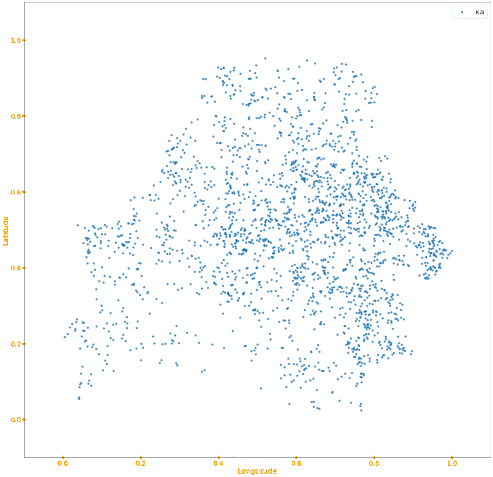

# Correlation between the names of cities of Belarus and their geographical position
## Project in The Basics of Data Analysis
### BSU FAMCS 2020

Here my little research on the upper topic is stored. I used Python (Pandas, asyncio, matplotlib) to parse and analyze datasets provided by [opendata.by](https://opendata.by/).

In files named PROJECT you can enjoy a russian version of my illustrated "research". Although it uses the basics of statistics, it does not pretend to be a real scientific article, so its content should be considered as entertaining stuff with an appropriate entertainig language and figuration.

The markdown version [PROJECT.md](PROJECT.md) can be read directly from github with no issue. All datasets mentioned are stored in "data" directory.

### Important note
Have a nice day :)