# Проект по ВКИАД
## Кузьмицкий Владимир
#### 13.12.2020

### В качестве темы для исследования я решил выбрать установление корреляции между географическим положением населённых городов Беларуси и структурой их названий. Ещё в начальной школе мне сказали, что в разных областях Беларуси можно проследить, какой город южнее (ближе к Украине) или восточнее (ближе к России), соответственно и Западнее/Севернее. В пример приводили какие-то отдельные названия городов и говорили что-то вроде "так много российских городов называется" или "звучит более украински".  И вот я выбрал это темой моего небольшого проектика, решив выяснить, действительно ли города различных регионов Беларуси также различаются в окончаниях своих названий.


### Итак, первый этап состоит в том, чтобы найти данные о городах Беларуси. Я, не мудрствуя лукаво, полез на логичный для этого домен 

[opendata.by](https://opendata.by/)

### Там я нашёл замечательный датасет с информацией, о городах Беларуси. Вот так выглядит скриншот из excel [с этими данными](https://opendata.by/node/480), которые, если верить составителям, актуальны на 2017 год.


### В самом деле выглядит неплохо...тут почти 24 тысячи позиций! Я и не думал, что в нашей прекрасной стране может быть так много населённых пунктов. Только вот есть два маленьких недостатка этого набора данных в рамках решения моей задачи.

### * Во-первых, тут присутствует лишняя информация, которую, в целях экономии времени, я бы убрал.
### * Во-вторых, тут не указаны географические координаты населённых пунктов, надо бы ещё откуда-то их достать.

### Решение первого подпункта довольно очевидно: удаляем ненужные столбцы прямо в MS excel :)


### Я оставил только колонки "вобласць", "раён", "назва па-беларуску", "назва па-расейску" и "osm: node ID". А ещё сохранил это всё в csv формате как punkty_belarusi_cleaned_1.csv

### "Что такое node ID?" спросите вы? А я отвечу: это идентификационный номер элемента местности в системе [Open Street Maps](https://www.openstreetmap.org/)

### C помощью этого номера можно получать информацию об объекте местности с использованием Open Street Maps API. Среди прочего, простым http запросом можно получить информацию и о широте/долготе населённого пункта, что и хочется мне сделать.

### Пришло время побаловаться с python: давайте получим информацию о городе Минск по вышеуказанной схеме.


```python
import requests as req

print(req.get("https://api.openstreetmap.org/api/0.6/node/26162465").text)
```

    <?xml version="1.0" encoding="UTF-8"?>
    <osm version="0.6" generator="CGImap 0.8.3 (906934 spike-07.openstreetmap.org)" copyright="OpenStreetMap and contributors" attribution="http://www.openstreetmap.org/copyright" license="http://opendatacommons.org/licenses/odbl/1-0/">
     <node id="26162465" visible="true" version="156" changeset="90482230" timestamp="2020-09-06T14:22:58Z" user="Iváns" uid="7579660" lat="53.9023340" lon="27.5618791">
      <tag k="addr:country" v="BY"/>
      <tag k="addr:postcode" v="220000"/>
      <tag k="admin_level" v="2"/>
      <tag k="alt_name:be" v="Менск"/>
      <tag k="alt_name:gl" v="Мінск"/>
      <tag k="alt_name:vi" v="Minsk;Minxcơva"/>
      <tag k="capital" v="yes"/>
      <tag k="capital_ISO3166-1" v="yes"/>
      <tag k="ele" v="280"/>
      <tag k="int_name" v="Minsk"/>
      <tag k="is_in:continent" v="Europe"/>
      <tag k="is_in:country" v="Belarus"/>
      <tag k="is_in:country_code" v="BY"/>
      <tag k="name" v="Минск"/>
      <tag k="name:ar" v="مينسك"/>
      <tag k="name:ast" v="Minsk"/>
      <tag k="name:bat-smg" v="Minsks"/>
      <tag k="name:be" v="Мінск"/>
      <tag k="name:be-tarask" v="Менск"/>
      <tag k="name:bg" v="Минск"/>
      <tag k="name:bo" v="མིན་སིཀ།"/>
      <tag k="name:ckb" v="مینسک"/>
      <tag k="name:cs" v="Minsk"/>
      <tag k="name:csb" v="Mińsk"/>
      <tag k="name:cu" v="Мѣньскъ"/>
      <tag k="name:cv" v="Минск"/>
      <tag k="name:de" v="Minsk"/>
      <tag k="name:el" v="Μινσκ"/>
      <tag k="name:en" v="Minsk"/>
      <tag k="name:eo" v="Minsko"/>
      <tag k="name:es" v="Minsk"/>
      <tag k="name:et" v="Minsk"/>
      <tag k="name:fa" v="مینسک"/>
      <tag k="name:fi" v="Minsk"/>
      <tag k="name:fr" v="Minsk"/>
      <tag k="name:ga" v="Minsc"/>
      <tag k="name:gl" v="Minsk"/>
      <tag k="name:he" v="מינסק"/>
      <tag k="name:hi" v="मिन्‍स्‍क"/>
      <tag k="name:hr" v="Minsk"/>
      <tag k="name:hu" v="Minszk"/>
      <tag k="name:hy" v="Մինսկ"/>
      <tag k="name:ia" v="Minsk"/>
      <tag k="name:io" v="Minsk"/>
      <tag k="name:is" v="Minsk"/>
      <tag k="name:it" v="Minsk"/>
      <tag k="name:ja" v="ミンスク"/>
      <tag k="name:jbo" v="misk"/>
      <tag k="name:ka" v="მინსკი"/>
      <tag k="name:kk" v="Минск"/>
      <tag k="name:kn" v="ಮಿನ್ಸ್ಕ್"/>
      <tag k="name:ko" v="민스크"/>
      <tag k="name:ku" v="Mînsk"/>
      <tag k="name:kv" v="Минск"/>
      <tag k="name:ky" v="Минск"/>
      <tag k="name:la" v="Minscum"/>
      <tag k="name:lt" v="Minskas"/>
      <tag k="name:lv" v="Minska"/>
      <tag k="name:mhr" v="Минск"/>
      <tag k="name:mk" v="Минск"/>
      <tag k="name:ml" v="മിൻസ്ക്"/>
      <tag k="name:mr" v="मिन्‍स्‍क"/>
      <tag k="name:myv" v="Минск ош"/>
      <tag k="name:nds" v="Minsk"/>
      <tag k="name:nl" v="Minsk"/>
      <tag k="name:no" v="Minsk"/>
      <tag k="name:oc" v="Minsk"/>
      <tag k="name:os" v="Минск"/>
      <tag k="name:pl" v="Mińsk"/>
      <tag k="name:pnb" v="منسک"/>
      <tag k="name:prefix" v="город"/>
      <tag k="name:pt" v="Minsk"/>
      <tag k="name:ru" v="Минск"/>
      <tag k="name:rue" v="Мінск"/>
      <tag k="name:sah" v="Минскай"/>
      <tag k="name:sk" v="Minsk"/>
      <tag k="name:sl" v="Minsk"/>
      <tag k="name:sr" v="Минск"/>
      <tag k="name:sr-Latn" v="Minsk"/>
      <tag k="name:sv" v="Minsk"/>
      <tag k="name:szl" v="Mińsk"/>
      <tag k="name:ta" v="மின்ஸ்க்"/>
      <tag k="name:tg" v="Минск"/>
      <tag k="name:th" v="มินสก์"/>
      <tag k="name:tt" v="Минск"/>
      <tag k="name:udm" v="Минск"/>
      <tag k="name:ug" v="مىنىسكى"/>
      <tag k="name:uk" v="Мінськ"/>
      <tag k="name:ur" v="منسک"/>
      <tag k="name:vi" v="Minxcơ"/>
      <tag k="name:vo" v="Minsk"/>
      <tag k="name:wuu" v="明斯克"/>
      <tag k="name:yi" v="מינסק"/>
      <tag k="name:zh" v="明斯克"/>
      <tag k="nat_name" v="Мінск"/>
      <tag k="old_name" v="Менск"/>
      <tag k="old_name:be" v="Менск"/>
      <tag k="place" v="city"/>
      <tag k="population" v="1982444"/>
      <tag k="population:date" v="2018-01-01"/>
      <tag k="source:name:oc" v="Lo Congrès"/>
      <tag k="source:population" v="Белстат"/>
      <tag k="website" v="https://minsk.gov.by/"/>
      <tag k="wikidata" v="Q2280"/>
      <tag k="wikipedia" v="ru:Минск"/>
      <tag k="wikipedia:be" v="Мінск"/>
      <tag k="wikipedia:en" v="Minsk"/>
      <tag k="wikipedia:pl" v="Mińsk"/>
     </node>
    </osm>
    
    

### Нас интересуют два указанных поля (на скриншоте выделены красным)


### Несложно догадаться, что получать интересующие нас значения можно с помощью регулярных выражений :) Осталось автоматизировать остальной процесс. Воспользуемся Pandas и загрузим очищенную версию данных как csv.

### Только сначала немножко поимпортим.


```python
import pandas as pd
import numpy as np
import math
import re
import aiohttp
import asyncio
import matplotlib.pyplot as plt
from pandas import Series, DataFrame
from aiohttp import ClientSession
from collections import defaultdict
```

### Загружаем информацию о городах и очищаем её от тех позиций, для которых не удастся прочитать id, а также переименовываем колонки, чтобы код солиднее смотрелся.


```python
data = pd.DataFrame(pd.read_csv("punkty_belarusi_cleaned_1.csv", sep=";"))
data = data[data['osm:Node ID'].notna()]
data = data.astype({"osm:Node ID": "int64"})
data = data.rename(columns={"Вобласць": "region", "Раён": "district", "Назва без націскаў": "blr_name", "Назва па-расейску": "rus_name", "osm:Node ID": "id"})
data
```


<div>
<style scoped>
    .dataframe tbody tr th:only-of-type {
        vertical-align: middle;
    }

    .dataframe tbody tr th {
        vertical-align: top;
    }

    .dataframe thead th {
        text-align: right;
    }
</style>
<table border="1" class="dataframe">
  <thead>
    <tr style="text-align: right;">
      <th></th>
      <th>region</th>
      <th>district</th>
      <th>blr_name</th>
      <th>rus_name</th>
      <th>id</th>
    </tr>
  </thead>
  <tbody>
    <tr>
      <th>0</th>
      <td>Брэсцкая</td>
      <td>&lt;вобласць&gt;</td>
      <td>Брэст</td>
      <td>Брест</td>
      <td>27171628</td>
    </tr>
    <tr>
      <th>1</th>
      <td>Брэсцкая</td>
      <td>&lt;вобласць&gt;</td>
      <td>Баранавічы</td>
      <td>Барановичи</td>
      <td>242978911</td>
    </tr>
    <tr>
      <th>2</th>
      <td>Брэсцкая</td>
      <td>&lt;вобласць&gt;</td>
      <td>Пінск</td>
      <td>Пинск</td>
      <td>242978912</td>
    </tr>
    <tr>
      <th>3</th>
      <td>Брэсцкая</td>
      <td>Баранавіцкі</td>
      <td>Гарадзішча</td>
      <td>Городище</td>
      <td>242979015</td>
    </tr>
    <tr>
      <th>4</th>
      <td>Брэсцкая</td>
      <td>Баранавіцкі</td>
      <td>Амнявічы</td>
      <td>Омневичи</td>
      <td>242992435</td>
    </tr>
    <tr>
      <th>...</th>
      <td>...</td>
      <td>...</td>
      <td>...</td>
      <td>...</td>
      <td>...</td>
    </tr>
    <tr>
      <th>23966</th>
      <td>Мінская</td>
      <td>Чэрвеньскі</td>
      <td>Пятроўка</td>
      <td>Петровка</td>
      <td>243022922</td>
    </tr>
    <tr>
      <th>23967</th>
      <td>Мінская</td>
      <td>Чэрвеньскі</td>
      <td>Ратнае</td>
      <td>Ратное</td>
      <td>243025750</td>
    </tr>
    <tr>
      <th>23968</th>
      <td>Мінская</td>
      <td>Чэрвеньскі</td>
      <td>Стары Пруд</td>
      <td>Старый Пруд</td>
      <td>243022754</td>
    </tr>
    <tr>
      <th>23969</th>
      <td>Мінская</td>
      <td>Чэрвеньскі</td>
      <td>Хутар</td>
      <td>Хутор</td>
      <td>243022771</td>
    </tr>
    <tr>
      <th>23970</th>
      <td>Мінская</td>
      <td>Чэрвеньскі</td>
      <td>Юравічы</td>
      <td>Юровичи</td>
      <td>243022914</td>
    </tr>
  </tbody>
</table>
<p>23444 rows × 5 columns</p>
</div>


### Давайте попробуем для каждой указанной позиции получить ширину и долготу, а также сохранить их в две новые колонки


```python
data["latitude"] = np.nan
data["longtitude"] = np.nan
data
```


<div>
<style scoped>
    .dataframe tbody tr th:only-of-type {
        vertical-align: middle;
    }

    .dataframe tbody tr th {
        vertical-align: top;
    }

    .dataframe thead th {
        text-align: right;
    }
</style>
<table border="1" class="dataframe">
  <thead>
    <tr style="text-align: right;">
      <th></th>
      <th>region</th>
      <th>district</th>
      <th>blr_name</th>
      <th>rus_name</th>
      <th>id</th>
      <th>latitude</th>
      <th>longtitude</th>
    </tr>
  </thead>
  <tbody>
    <tr>
      <th>0</th>
      <td>Брэсцкая</td>
      <td>&lt;вобласць&gt;</td>
      <td>Брэст</td>
      <td>Брест</td>
      <td>27171628</td>
      <td>NaN</td>
      <td>NaN</td>
    </tr>
    <tr>
      <th>1</th>
      <td>Брэсцкая</td>
      <td>&lt;вобласць&gt;</td>
      <td>Баранавічы</td>
      <td>Барановичи</td>
      <td>242978911</td>
      <td>NaN</td>
      <td>NaN</td>
    </tr>
    <tr>
      <th>2</th>
      <td>Брэсцкая</td>
      <td>&lt;вобласць&gt;</td>
      <td>Пінск</td>
      <td>Пинск</td>
      <td>242978912</td>
      <td>NaN</td>
      <td>NaN</td>
    </tr>
    <tr>
      <th>3</th>
      <td>Брэсцкая</td>
      <td>Баранавіцкі</td>
      <td>Гарадзішча</td>
      <td>Городище</td>
      <td>242979015</td>
      <td>NaN</td>
      <td>NaN</td>
    </tr>
    <tr>
      <th>4</th>
      <td>Брэсцкая</td>
      <td>Баранавіцкі</td>
      <td>Амнявічы</td>
      <td>Омневичи</td>
      <td>242992435</td>
      <td>NaN</td>
      <td>NaN</td>
    </tr>
    <tr>
      <th>...</th>
      <td>...</td>
      <td>...</td>
      <td>...</td>
      <td>...</td>
      <td>...</td>
      <td>...</td>
      <td>...</td>
    </tr>
    <tr>
      <th>23966</th>
      <td>Мінская</td>
      <td>Чэрвеньскі</td>
      <td>Пятроўка</td>
      <td>Петровка</td>
      <td>243022922</td>
      <td>NaN</td>
      <td>NaN</td>
    </tr>
    <tr>
      <th>23967</th>
      <td>Мінская</td>
      <td>Чэрвеньскі</td>
      <td>Ратнае</td>
      <td>Ратное</td>
      <td>243025750</td>
      <td>NaN</td>
      <td>NaN</td>
    </tr>
    <tr>
      <th>23968</th>
      <td>Мінская</td>
      <td>Чэрвеньскі</td>
      <td>Стары Пруд</td>
      <td>Старый Пруд</td>
      <td>243022754</td>
      <td>NaN</td>
      <td>NaN</td>
    </tr>
    <tr>
      <th>23969</th>
      <td>Мінская</td>
      <td>Чэрвеньскі</td>
      <td>Хутар</td>
      <td>Хутор</td>
      <td>243022771</td>
      <td>NaN</td>
      <td>NaN</td>
    </tr>
    <tr>
      <th>23970</th>
      <td>Мінская</td>
      <td>Чэрвеньскі</td>
      <td>Юравічы</td>
      <td>Юровичи</td>
      <td>243022914</td>
      <td>NaN</td>
      <td>NaN</td>
    </tr>
  </tbody>
</table>
<p>23444 rows × 7 columns</p>
</div>


### Наученный горьким опытом бесполезного ожидания (больше часа и всё зря!), я распараллелю процесс обработки запросов с помощью asyncio и aiohttp. Теперь всё занимает не более пары минуточек, но чуть подождать всё же придётся.


```python
request_prefix_url = "https://api.openstreetmap.org/api/0.6/node/"
counter = 0
failed_counter = 0

def handle_coordinates(response, index):
    global data
    global failed_counter
    longtitude = re.findall(r"lon=\"(\d+\.\d+)\"", response)
    latitude = re.findall(r"lat=\"(\d+\.\d+)\"", response)
    if len(latitude) == 0 or len(longtitude) == 0:
#             print("Error on row " + str(index))
            failed_counter += 1
            return 
    data.at[index, "latitude"] = float(latitude[0])
    data.at[index, "longtitude"] = float(longtitude[0])

    
async def get_node_details(id, session):
    global counter
    url = request_prefix_url + id
    try:
        response = await session.request(method='GET', url=url)
        response.raise_for_status()
        counter += 1
#         print(counter)
    except Exception as err:
#         print(f"An error ocurred: {err}")
        pass
    return await response.text()


async def run_program(index, session):
    try:
        response = await get_node_details(str(data.at[index, "id"]), session)
        handle_coordinates(response, index)
    except Exception as err:
#         print(f"Exception occured__: {err}")
        pass
        

async with ClientSession() as session:
    await asyncio.gather(*[run_program(index, session) for index in data.index])
```

### Приведём чуть в порядок и сохраним


```python
print("From: {}\nFailed: {}".format(counter, failed_counter))
data = data[data['latitude'].notna()]
data = data[data['longtitude'].notna()]
data.to_csv("punkty_belarusi_with_cooridnates.csv", sep=";")
data
```

    From: 23225
    Failed: 214
    


<div>
<style scoped>
    .dataframe tbody tr th:only-of-type {
        vertical-align: middle;
    }

    .dataframe tbody tr th {
        vertical-align: top;
    }

    .dataframe thead th {
        text-align: right;
    }
</style>
<table border="1" class="dataframe">
  <thead>
    <tr style="text-align: right;">
      <th></th>
      <th>region</th>
      <th>district</th>
      <th>blr_name</th>
      <th>rus_name</th>
      <th>id</th>
      <th>latitude</th>
      <th>longtitude</th>
    </tr>
  </thead>
  <tbody>
    <tr>
      <th>0</th>
      <td>Брэсцкая</td>
      <td>&lt;вобласць&gt;</td>
      <td>Брэст</td>
      <td>Брест</td>
      <td>27171628</td>
      <td>52.093751</td>
      <td>23.685185</td>
    </tr>
    <tr>
      <th>1</th>
      <td>Брэсцкая</td>
      <td>&lt;вобласць&gt;</td>
      <td>Баранавічы</td>
      <td>Барановичи</td>
      <td>242978911</td>
      <td>53.132292</td>
      <td>26.018416</td>
    </tr>
    <tr>
      <th>2</th>
      <td>Брэсцкая</td>
      <td>&lt;вобласць&gt;</td>
      <td>Пінск</td>
      <td>Пинск</td>
      <td>242978912</td>
      <td>52.111361</td>
      <td>26.102377</td>
    </tr>
    <tr>
      <th>3</th>
      <td>Брэсцкая</td>
      <td>Баранавіцкі</td>
      <td>Гарадзішча</td>
      <td>Городище</td>
      <td>242979015</td>
      <td>53.326824</td>
      <td>26.005677</td>
    </tr>
    <tr>
      <th>4</th>
      <td>Брэсцкая</td>
      <td>Баранавіцкі</td>
      <td>Амнявічы</td>
      <td>Омневичи</td>
      <td>242992435</td>
      <td>53.355020</td>
      <td>25.902420</td>
    </tr>
    <tr>
      <th>...</th>
      <td>...</td>
      <td>...</td>
      <td>...</td>
      <td>...</td>
      <td>...</td>
      <td>...</td>
      <td>...</td>
    </tr>
    <tr>
      <th>23966</th>
      <td>Мінская</td>
      <td>Чэрвеньскі</td>
      <td>Пятроўка</td>
      <td>Петровка</td>
      <td>243022922</td>
      <td>53.694300</td>
      <td>28.702980</td>
    </tr>
    <tr>
      <th>23967</th>
      <td>Мінская</td>
      <td>Чэрвеньскі</td>
      <td>Ратнае</td>
      <td>Ратное</td>
      <td>243025750</td>
      <td>53.785280</td>
      <td>28.748050</td>
    </tr>
    <tr>
      <th>23968</th>
      <td>Мінская</td>
      <td>Чэрвеньскі</td>
      <td>Стары Пруд</td>
      <td>Старый Пруд</td>
      <td>243022754</td>
      <td>53.761984</td>
      <td>28.620105</td>
    </tr>
    <tr>
      <th>23969</th>
      <td>Мінская</td>
      <td>Чэрвеньскі</td>
      <td>Хутар</td>
      <td>Хутор</td>
      <td>243022771</td>
      <td>53.760812</td>
      <td>28.684500</td>
    </tr>
    <tr>
      <th>23970</th>
      <td>Мінская</td>
      <td>Чэрвеньскі</td>
      <td>Юравічы</td>
      <td>Юровичи</td>
      <td>243022914</td>
      <td>53.785000</td>
      <td>28.691109</td>
    </tr>
  </tbody>
</table>
<p>23225 rows × 7 columns</p>
</div>


## Установление зависимости

### Первое, что приходит в голову, это посмотреть на среднее значение широты и долготы для пунктов с одинаковыми окончаниями. Давайте взглянем, какие они вообще бывают


```python
def get_ending(word):
    return word[-2:]

data["blr_ending"] = ""
data["rus_ending"] = ""
for index in data.index:
    data.loc[index, "blr_ending"] =  get_ending(data.at[index, "blr_name"])
    data.loc[index, "rus_ending"] =  get_ending(data.at[index, "rus_name"])
data
```


<div>
<style scoped>
    .dataframe tbody tr th:only-of-type {
        vertical-align: middle;
    }

    .dataframe tbody tr th {
        vertical-align: top;
    }

    .dataframe thead th {
        text-align: right;
    }
</style>
<table border="1" class="dataframe">
  <thead>
    <tr style="text-align: right;">
      <th></th>
      <th>region</th>
      <th>district</th>
      <th>blr_name</th>
      <th>rus_name</th>
      <th>id</th>
      <th>latitude</th>
      <th>longtitude</th>
      <th>blr_ending</th>
      <th>rus_ending</th>
    </tr>
  </thead>
  <tbody>
    <tr>
      <th>0</th>
      <td>Брэсцкая</td>
      <td>&lt;вобласць&gt;</td>
      <td>Брэст</td>
      <td>Брест</td>
      <td>27171628</td>
      <td>52.093751</td>
      <td>23.685185</td>
      <td>ст</td>
      <td>ст</td>
    </tr>
    <tr>
      <th>1</th>
      <td>Брэсцкая</td>
      <td>&lt;вобласць&gt;</td>
      <td>Баранавічы</td>
      <td>Барановичи</td>
      <td>242978911</td>
      <td>53.132292</td>
      <td>26.018416</td>
      <td>чы</td>
      <td>чи</td>
    </tr>
    <tr>
      <th>2</th>
      <td>Брэсцкая</td>
      <td>&lt;вобласць&gt;</td>
      <td>Пінск</td>
      <td>Пинск</td>
      <td>242978912</td>
      <td>52.111361</td>
      <td>26.102377</td>
      <td>ск</td>
      <td>ск</td>
    </tr>
    <tr>
      <th>3</th>
      <td>Брэсцкая</td>
      <td>Баранавіцкі</td>
      <td>Гарадзішча</td>
      <td>Городище</td>
      <td>242979015</td>
      <td>53.326824</td>
      <td>26.005677</td>
      <td>ча</td>
      <td>ще</td>
    </tr>
    <tr>
      <th>4</th>
      <td>Брэсцкая</td>
      <td>Баранавіцкі</td>
      <td>Амнявічы</td>
      <td>Омневичи</td>
      <td>242992435</td>
      <td>53.355020</td>
      <td>25.902420</td>
      <td>чы</td>
      <td>чи</td>
    </tr>
    <tr>
      <th>...</th>
      <td>...</td>
      <td>...</td>
      <td>...</td>
      <td>...</td>
      <td>...</td>
      <td>...</td>
      <td>...</td>
      <td>...</td>
      <td>...</td>
    </tr>
    <tr>
      <th>23966</th>
      <td>Мінская</td>
      <td>Чэрвеньскі</td>
      <td>Пятроўка</td>
      <td>Петровка</td>
      <td>243022922</td>
      <td>53.694300</td>
      <td>28.702980</td>
      <td>ка</td>
      <td>ка</td>
    </tr>
    <tr>
      <th>23967</th>
      <td>Мінская</td>
      <td>Чэрвеньскі</td>
      <td>Ратнае</td>
      <td>Ратное</td>
      <td>243025750</td>
      <td>53.785280</td>
      <td>28.748050</td>
      <td>ае</td>
      <td>ое</td>
    </tr>
    <tr>
      <th>23968</th>
      <td>Мінская</td>
      <td>Чэрвеньскі</td>
      <td>Стары Пруд</td>
      <td>Старый Пруд</td>
      <td>243022754</td>
      <td>53.761984</td>
      <td>28.620105</td>
      <td>уд</td>
      <td>уд</td>
    </tr>
    <tr>
      <th>23969</th>
      <td>Мінская</td>
      <td>Чэрвеньскі</td>
      <td>Хутар</td>
      <td>Хутор</td>
      <td>243022771</td>
      <td>53.760812</td>
      <td>28.684500</td>
      <td>ар</td>
      <td>ор</td>
    </tr>
    <tr>
      <th>23970</th>
      <td>Мінская</td>
      <td>Чэрвеньскі</td>
      <td>Юравічы</td>
      <td>Юровичи</td>
      <td>243022914</td>
      <td>53.785000</td>
      <td>28.691109</td>
      <td>чы</td>
      <td>чи</td>
    </tr>
  </tbody>
</table>
<p>23225 rows × 9 columns</p>
</div>


```python
def handle_endings(names):
    endings = defaultdict(lambda: 0)
    for name in names:
        ending = get_ending(name)
        endings[ending] += 1
    sorted_endings = sorted(endings.items(), key=lambda kv: kv[1], reverse=True)
    endings = dict([(key, value) for key, value in sorted_endings])
    return defaultdict(int, endings)

blr_endings = handle_endings(data["blr_name"])
print(blr_endings)
endings_data = pd.DataFrame(dict(blr_endings).items(), columns=["ending", "total"])
endings_data[:50]
```

    defaultdict(<class 'int'>, {'кі': 3153, 'чы': 2261, 'ка': 2239, 'ва': 2074, 'на': 1930, 'цы': 986, 'ны': 825, 'ча': 619, 'ца': 401, 'ае': 369, 'ры': 322, 'ая': 319, 'да': 301, 'лі': 274, 'ец': 258, 'ты': 237, 'ле': 216, 'лы': 203, 'ня': 200, 'нь': 198, 'ок': 190, 'ды': 189, 'ні': 189, '’е': 184, 'ск': 179, 'шы': 173, 'аў': 168, ' 2': 162, ' 1': 158, 'ін': 154, 'ія': 137, 'ль': 136, 'це': 128, 'гі': 119, 'се': 118, 'не': 116, 'хі': 115, 'та': 111, 'ша': 105, 'ыя': 104, 'ын': 102, 'жа': 99, 'ра': 97, 'ор': 95, 'зе': 95, 'сы': 92, 'ое': 81, 'ці': 78, 'ло': 77, 'ік': 71, 'ўе': 67, 'вы': 66, 'но': 65, 'оў': 62, 'ля': 61, 'бы': 56, 'ак': 55, 'ар': 51, 'зы': 50, 'ць': 50, 'аі': 45, 'га': 40, 'мы': 38, 'эц': 37, 'зь': 37, 'ха': 37, 'ай': 37, 'зі': 36, 'цк': 36, 'жы': 36, 'ог': 35, 'ма': 33, 'пы': 33, 'еж': 31, 'ан': 30, 'ба': 29, 'ач': 29, 'ес': 29, 'од': 29, 'ла': 24, 'ст': 22, 'са': 21, 'ет': 20, 'сі': 20, 'па': 18, 'ал': 18, 'аг': 18, ' 3': 16, 'бр': 16, 'аж': 16, 'уд': 15, 'еі': 15, 'ея': 14, 'за': 14, 'ад': 14, 'ер': 13, 'уб': 12, 'сь': 12, 'ык': 12, 'уг': 10, 'уі': 10, 'он': 10, 'ёў': 10, 'ір': 9, 'ох': 9, 'як': 9, 'ўі': 9, 'цё': 9, 'іч': 9, 'яі': 8, 'оз': 8, 'ук': 8, 'еў': 8, 'ас': 8, 'аш': 7, 'еч': 7, 'цо': 7, '’і': 7, 'іж': 7, 'яя': 7, 'эс': 7, 'эя': 6, '’я': 6, 'ол': 6, 'ут': 6, 'ыр': 6, 'рг': 6, 'ый': 6, 'уп': 6, 'ел': 5, 'шч': 5, 'оп': 5, 'ім': 5, 'ой': 5, 'чо': 5, 'мя': 5, 'рд': 5, 'ёк': 5, 'ыш': 4, 'ыч': 4, 'яе': 4, 'уя': 4, 'ат': 4, 'ўё': 4, 'оі': 4, 'ёл': 4, 'рн': 4, 'ьч': 4, 'ях': 4, 'пі': 4, 'ёс': 3, 'яж': 3, 'уж': 3, 'уш': 3, 'ац': 3, 'уй': 3, 'ко': 3, 'ыж': 3, 'уч': 3, 'ун': 3, 'ом': 3, 'ам': 3, 'мо': 2, 'то': 2, 'ус': 2, 'ек': 2, 'яч': 2, 'шо': 2, 'юч': 2, 'нт': 2, 'ум': 2, 'лё': 2, '’ё': 2, 'яг': 2, 'ож': 2, 'эп': 2, 'рс': 2, 'рч': 2, 'іш': 2, 'ьс': 2, 'із': 2, 'эй': 2, 'зё': 2, 'ій': 1, 'ро': 1, 'ыі': 1, 'Ор': 1, 'ух': 1, 'рэ': 1, 'яз': 1, 'лм': 1, 'Яя': 1, ' 5': 1, ' 4': 1, ' 6': 1, 'кт': 1, 'Шо': 1, 'рф': 1, 'сё': 1, 'ех': 1, 'ТС': 1, 'от': 1, 'ей': 1, 'оя': 1, 'ёж': 1, 'ўж': 1, 'аз': 1, 'зд': 1, 'рп': 1, 'лк': 1, 'ві': 1, 'ўя': 1, 'юб': 1, 'д)': 1, 'му': 1, 'юн': 1, 'ур': 1, 'нг': 1, 'пр': 1, 'ош': 1, 'эў': 1, 'ёз': 1, 'эм': 1, 'юм': 1, 'ья': 1, 'ён': 1, 'юі': 1, 'Яр': 1, 'аб': 1})
    


<div>
<style scoped>
    .dataframe tbody tr th:only-of-type {
        vertical-align: middle;
    }

    .dataframe tbody tr th {
        vertical-align: top;
    }

    .dataframe thead th {
        text-align: right;
    }
</style>
<table border="1" class="dataframe">
  <thead>
    <tr style="text-align: right;">
      <th></th>
      <th>ending</th>
      <th>total</th>
    </tr>
  </thead>
  <tbody>
    <tr>
      <th>0</th>
      <td>кі</td>
      <td>3153</td>
    </tr>
    <tr>
      <th>1</th>
      <td>чы</td>
      <td>2261</td>
    </tr>
    <tr>
      <th>2</th>
      <td>ка</td>
      <td>2239</td>
    </tr>
    <tr>
      <th>3</th>
      <td>ва</td>
      <td>2074</td>
    </tr>
    <tr>
      <th>4</th>
      <td>на</td>
      <td>1930</td>
    </tr>
    <tr>
      <th>5</th>
      <td>цы</td>
      <td>986</td>
    </tr>
    <tr>
      <th>6</th>
      <td>ны</td>
      <td>825</td>
    </tr>
    <tr>
      <th>7</th>
      <td>ча</td>
      <td>619</td>
    </tr>
    <tr>
      <th>8</th>
      <td>ца</td>
      <td>401</td>
    </tr>
    <tr>
      <th>9</th>
      <td>ае</td>
      <td>369</td>
    </tr>
    <tr>
      <th>10</th>
      <td>ры</td>
      <td>322</td>
    </tr>
    <tr>
      <th>11</th>
      <td>ая</td>
      <td>319</td>
    </tr>
    <tr>
      <th>12</th>
      <td>да</td>
      <td>301</td>
    </tr>
    <tr>
      <th>13</th>
      <td>лі</td>
      <td>274</td>
    </tr>
    <tr>
      <th>14</th>
      <td>ец</td>
      <td>258</td>
    </tr>
    <tr>
      <th>15</th>
      <td>ты</td>
      <td>237</td>
    </tr>
    <tr>
      <th>16</th>
      <td>ле</td>
      <td>216</td>
    </tr>
    <tr>
      <th>17</th>
      <td>лы</td>
      <td>203</td>
    </tr>
    <tr>
      <th>18</th>
      <td>ня</td>
      <td>200</td>
    </tr>
    <tr>
      <th>19</th>
      <td>нь</td>
      <td>198</td>
    </tr>
    <tr>
      <th>20</th>
      <td>ок</td>
      <td>190</td>
    </tr>
    <tr>
      <th>21</th>
      <td>ды</td>
      <td>189</td>
    </tr>
    <tr>
      <th>22</th>
      <td>ні</td>
      <td>189</td>
    </tr>
    <tr>
      <th>23</th>
      <td>’е</td>
      <td>184</td>
    </tr>
    <tr>
      <th>24</th>
      <td>ск</td>
      <td>179</td>
    </tr>
    <tr>
      <th>25</th>
      <td>шы</td>
      <td>173</td>
    </tr>
    <tr>
      <th>26</th>
      <td>аў</td>
      <td>168</td>
    </tr>
    <tr>
      <th>27</th>
      <td>2</td>
      <td>162</td>
    </tr>
    <tr>
      <th>28</th>
      <td>1</td>
      <td>158</td>
    </tr>
    <tr>
      <th>29</th>
      <td>ін</td>
      <td>154</td>
    </tr>
    <tr>
      <th>30</th>
      <td>ія</td>
      <td>137</td>
    </tr>
    <tr>
      <th>31</th>
      <td>ль</td>
      <td>136</td>
    </tr>
    <tr>
      <th>32</th>
      <td>це</td>
      <td>128</td>
    </tr>
    <tr>
      <th>33</th>
      <td>гі</td>
      <td>119</td>
    </tr>
    <tr>
      <th>34</th>
      <td>се</td>
      <td>118</td>
    </tr>
    <tr>
      <th>35</th>
      <td>не</td>
      <td>116</td>
    </tr>
    <tr>
      <th>36</th>
      <td>хі</td>
      <td>115</td>
    </tr>
    <tr>
      <th>37</th>
      <td>та</td>
      <td>111</td>
    </tr>
    <tr>
      <th>38</th>
      <td>ша</td>
      <td>105</td>
    </tr>
    <tr>
      <th>39</th>
      <td>ыя</td>
      <td>104</td>
    </tr>
    <tr>
      <th>40</th>
      <td>ын</td>
      <td>102</td>
    </tr>
    <tr>
      <th>41</th>
      <td>жа</td>
      <td>99</td>
    </tr>
    <tr>
      <th>42</th>
      <td>ра</td>
      <td>97</td>
    </tr>
    <tr>
      <th>43</th>
      <td>ор</td>
      <td>95</td>
    </tr>
    <tr>
      <th>44</th>
      <td>зе</td>
      <td>95</td>
    </tr>
    <tr>
      <th>45</th>
      <td>сы</td>
      <td>92</td>
    </tr>
    <tr>
      <th>46</th>
      <td>ое</td>
      <td>81</td>
    </tr>
    <tr>
      <th>47</th>
      <td>ці</td>
      <td>78</td>
    </tr>
    <tr>
      <th>48</th>
      <td>ло</td>
      <td>77</td>
    </tr>
    <tr>
      <th>49</th>
      <td>ік</td>
      <td>71</td>
    </tr>
  </tbody>
</table>
</div>


### Теперь давайте посчитаем какую-нибудь абстрактную штуку вроде среднего значения широты для того или иного окончания и посмотрим, насколько действительно различаются эти показатели.


```python
endings_data["average_latitude"] = 0.0
endings_data["average_longtitude"] = 0.0
endings_data
```


<div>
<style scoped>
    .dataframe tbody tr th:only-of-type {
        vertical-align: middle;
    }

    .dataframe tbody tr th {
        vertical-align: top;
    }

    .dataframe thead th {
        text-align: right;
    }
</style>
<table border="1" class="dataframe">
  <thead>
    <tr style="text-align: right;">
      <th></th>
      <th>ending</th>
      <th>total</th>
      <th>average_latitude</th>
      <th>average_longtitude</th>
    </tr>
  </thead>
  <tbody>
    <tr>
      <th>0</th>
      <td>кі</td>
      <td>3153</td>
      <td>0.0</td>
      <td>0.0</td>
    </tr>
    <tr>
      <th>1</th>
      <td>чы</td>
      <td>2261</td>
      <td>0.0</td>
      <td>0.0</td>
    </tr>
    <tr>
      <th>2</th>
      <td>ка</td>
      <td>2239</td>
      <td>0.0</td>
      <td>0.0</td>
    </tr>
    <tr>
      <th>3</th>
      <td>ва</td>
      <td>2074</td>
      <td>0.0</td>
      <td>0.0</td>
    </tr>
    <tr>
      <th>4</th>
      <td>на</td>
      <td>1930</td>
      <td>0.0</td>
      <td>0.0</td>
    </tr>
    <tr>
      <th>...</th>
      <td>...</td>
      <td>...</td>
      <td>...</td>
      <td>...</td>
    </tr>
    <tr>
      <th>224</th>
      <td>ья</td>
      <td>1</td>
      <td>0.0</td>
      <td>0.0</td>
    </tr>
    <tr>
      <th>225</th>
      <td>ён</td>
      <td>1</td>
      <td>0.0</td>
      <td>0.0</td>
    </tr>
    <tr>
      <th>226</th>
      <td>юі</td>
      <td>1</td>
      <td>0.0</td>
      <td>0.0</td>
    </tr>
    <tr>
      <th>227</th>
      <td>Яр</td>
      <td>1</td>
      <td>0.0</td>
      <td>0.0</td>
    </tr>
    <tr>
      <th>228</th>
      <td>аб</td>
      <td>1</td>
      <td>0.0</td>
      <td>0.0</td>
    </tr>
  </tbody>
</table>
<p>229 rows × 4 columns</p>
</div>


```python
for index in data.index:
#     print(index)
    ending = get_ending(data.at[index, "blr_name"])
    endings_data.loc[endings_data["ending"] == ending, "average_latitude"] += data.at[index, "latitude"]
    endings_data.loc[endings_data["ending"] == ending, "average_longtitude"] += data.at[index, "longtitude"]
for index in endings_data.index:
    endings_data.at[index, "average_latitude"] /= endings_data.at[index, "total"]
    endings_data.at[index, "average_longtitude"] /= endings_data.at[index, "total"]
endings_data
```


<div>
<style scoped>
    .dataframe tbody tr th:only-of-type {
        vertical-align: middle;
    }

    .dataframe tbody tr th {
        vertical-align: top;
    }

    .dataframe thead th {
        text-align: right;
    }
</style>
<table border="1" class="dataframe">
  <thead>
    <tr style="text-align: right;">
      <th></th>
      <th>ending</th>
      <th>total</th>
      <th>average_latitude</th>
      <th>average_longtitude</th>
    </tr>
  </thead>
  <tbody>
    <tr>
      <th>0</th>
      <td>кі</td>
      <td>3153</td>
      <td>54.116258</td>
      <td>27.397853</td>
    </tr>
    <tr>
      <th>1</th>
      <td>чы</td>
      <td>2261</td>
      <td>53.541833</td>
      <td>27.176313</td>
    </tr>
    <tr>
      <th>2</th>
      <td>ка</td>
      <td>2239</td>
      <td>53.675438</td>
      <td>28.807168</td>
    </tr>
    <tr>
      <th>3</th>
      <td>ва</td>
      <td>2074</td>
      <td>54.215526</td>
      <td>28.233761</td>
    </tr>
    <tr>
      <th>4</th>
      <td>на</td>
      <td>1930</td>
      <td>54.270410</td>
      <td>27.920103</td>
    </tr>
    <tr>
      <th>...</th>
      <td>...</td>
      <td>...</td>
      <td>...</td>
      <td>...</td>
    </tr>
    <tr>
      <th>224</th>
      <td>ья</td>
      <td>1</td>
      <td>54.416310</td>
      <td>27.291410</td>
    </tr>
    <tr>
      <th>225</th>
      <td>ён</td>
      <td>1</td>
      <td>54.374682</td>
      <td>28.874564</td>
    </tr>
    <tr>
      <th>226</th>
      <td>юі</td>
      <td>1</td>
      <td>53.854980</td>
      <td>27.309780</td>
    </tr>
    <tr>
      <th>227</th>
      <td>Яр</td>
      <td>1</td>
      <td>53.602551</td>
      <td>28.048780</td>
    </tr>
    <tr>
      <th>228</th>
      <td>аб</td>
      <td>1</td>
      <td>53.807170</td>
      <td>28.596730</td>
    </tr>
  </tbody>
</table>
<p>229 rows × 4 columns</p>
</div>


### Так не очень понятно, что к чему, давайте используем min-max feature scaling


```python
data["scaled_latitude"] = np.nan
data["scaled_longtitude"] = np.nan

min_latitude = data["latitude"].min()
max_latitude = data["latitude"].max()
latitude_delta = max_latitude - min_latitude
min_longtitude = data["longtitude"].min()
max_longtitude = data["longtitude"].max()
longtitude_delta = max_longtitude - min_longtitude

for index in data.index:
#     print(index)
    data.at[index, "scaled_latitude"] = (data.at[index, "latitude"] - min_latitude) / latitude_delta
    data.at[index, "scaled_longtitude"] = (data.at[index, "longtitude"] - min_longtitude) / longtitude_delta
data

```


<div>
<style scoped>
    .dataframe tbody tr th:only-of-type {
        vertical-align: middle;
    }

    .dataframe tbody tr th {
        vertical-align: top;
    }

    .dataframe thead th {
        text-align: right;
    }
</style>
<table border="1" class="dataframe">
  <thead>
    <tr style="text-align: right;">
      <th></th>
      <th>region</th>
      <th>district</th>
      <th>blr_name</th>
      <th>rus_name</th>
      <th>id</th>
      <th>latitude</th>
      <th>longtitude</th>
      <th>blr_ending</th>
      <th>rus_ending</th>
      <th>scaled_latitude</th>
      <th>scaled_longtitude</th>
    </tr>
  </thead>
  <tbody>
    <tr>
      <th>0</th>
      <td>Брэсцкая</td>
      <td>&lt;вобласць&gt;</td>
      <td>Брэст</td>
      <td>Брест</td>
      <td>27171628</td>
      <td>52.093751</td>
      <td>23.685185</td>
      <td>ст</td>
      <td>ст</td>
      <td>0.165041</td>
      <td>0.049754</td>
    </tr>
    <tr>
      <th>1</th>
      <td>Брэсцкая</td>
      <td>&lt;вобласць&gt;</td>
      <td>Баранавічы</td>
      <td>Барановичи</td>
      <td>242978911</td>
      <td>53.132292</td>
      <td>26.018416</td>
      <td>чы</td>
      <td>чи</td>
      <td>0.379489</td>
      <td>0.294650</td>
    </tr>
    <tr>
      <th>2</th>
      <td>Брэсцкая</td>
      <td>&lt;вобласць&gt;</td>
      <td>Пінск</td>
      <td>Пинск</td>
      <td>242978912</td>
      <td>52.111361</td>
      <td>26.102377</td>
      <td>ск</td>
      <td>ск</td>
      <td>0.168677</td>
      <td>0.303463</td>
    </tr>
    <tr>
      <th>3</th>
      <td>Брэсцкая</td>
      <td>Баранавіцкі</td>
      <td>Гарадзішча</td>
      <td>Городище</td>
      <td>242979015</td>
      <td>53.326824</td>
      <td>26.005677</td>
      <td>ча</td>
      <td>ще</td>
      <td>0.419658</td>
      <td>0.293313</td>
    </tr>
    <tr>
      <th>4</th>
      <td>Брэсцкая</td>
      <td>Баранавіцкі</td>
      <td>Амнявічы</td>
      <td>Омневичи</td>
      <td>242992435</td>
      <td>53.355020</td>
      <td>25.902420</td>
      <td>чы</td>
      <td>чи</td>
      <td>0.425480</td>
      <td>0.282475</td>
    </tr>
    <tr>
      <th>...</th>
      <td>...</td>
      <td>...</td>
      <td>...</td>
      <td>...</td>
      <td>...</td>
      <td>...</td>
      <td>...</td>
      <td>...</td>
      <td>...</td>
      <td>...</td>
      <td>...</td>
    </tr>
    <tr>
      <th>23966</th>
      <td>Мінская</td>
      <td>Чэрвеньскі</td>
      <td>Пятроўка</td>
      <td>Петровка</td>
      <td>243022922</td>
      <td>53.694300</td>
      <td>28.702980</td>
      <td>ка</td>
      <td>ка</td>
      <td>0.495538</td>
      <td>0.576422</td>
    </tr>
    <tr>
      <th>23967</th>
      <td>Мінская</td>
      <td>Чэрвеньскі</td>
      <td>Ратнае</td>
      <td>Ратное</td>
      <td>243025750</td>
      <td>53.785280</td>
      <td>28.748050</td>
      <td>ае</td>
      <td>ое</td>
      <td>0.514324</td>
      <td>0.581153</td>
    </tr>
    <tr>
      <th>23968</th>
      <td>Мінская</td>
      <td>Чэрвеньскі</td>
      <td>Стары Пруд</td>
      <td>Старый Пруд</td>
      <td>243022754</td>
      <td>53.761984</td>
      <td>28.620105</td>
      <td>уд</td>
      <td>уд</td>
      <td>0.509514</td>
      <td>0.567723</td>
    </tr>
    <tr>
      <th>23969</th>
      <td>Мінская</td>
      <td>Чэрвеньскі</td>
      <td>Хутар</td>
      <td>Хутор</td>
      <td>243022771</td>
      <td>53.760812</td>
      <td>28.684500</td>
      <td>ар</td>
      <td>ор</td>
      <td>0.509272</td>
      <td>0.574482</td>
    </tr>
    <tr>
      <th>23970</th>
      <td>Мінская</td>
      <td>Чэрвеньскі</td>
      <td>Юравічы</td>
      <td>Юровичи</td>
      <td>243022914</td>
      <td>53.785000</td>
      <td>28.691109</td>
      <td>чы</td>
      <td>чи</td>
      <td>0.514266</td>
      <td>0.575176</td>
    </tr>
  </tbody>
</table>
<p>23225 rows × 11 columns</p>
</div>


### А теперь давайте проведём небольшую визуализацию происходящего с использованием matplotlib. Для начала напишем вот такой непримечательный блок кода.


```python
plt.rcParams.update({'font.size': 22,
                     'text.color' : "black",
                     'axes.labelcolor' : "orange"})

POINTS_IN_CURVES = 315
STROKE_WIDTH = 2.5
MARKER_SIZE = 9.0
FIGURE_SIZE = 25


TICKS_FONT_SIZE = 20.0
AXES_TICK_COLOR = "orange"

def prepare_plot():
    figure = plt.figure(figsize=(FIGURE_SIZE, FIGURE_SIZE))
    ax = plt.gca()
    ax.set_xlabel("Longtitude")
    ax.set_ylabel("Latitude")
    ax.tick_params(axis="both", width=5, length=10, direction="inout", color=AXES_TICK_COLOR)
    plt.xticks(fontsize=TICKS_FONT_SIZE, color=AXES_TICK_COLOR)
    plt.yticks(fontsize=TICKS_FONT_SIZE, color=AXES_TICK_COLOR)
    plt.xlim(-0.1, 1.1)
    plt.ylim(-0.1, 1.1)


def filtered_plot(drawing_data, function, classes, showlegend=True):  
    plt.close()
    prepare_plot()
    number_of_classes = len(classes)
    number_of_points = len(drawing_data)
    x=[[] for i in range(number_of_classes)]
    y=[[] for i in range(number_of_classes)]
    for index in drawing_data.index:
        result = function(drawing_data.at[index, "blr_name"])
        if result not in classes:
            continue        
        result_index = classes.index(result)
        x[result_index].append(drawing_data.at[index, "scaled_longtitude"])
        y[result_index].append(drawing_data.at[index, "scaled_latitude"])
    x_np = np.array([np.array(i) for i in x], dtype=object)
    y_np = np.array([np.array(i) for i in y], dtype=object)
    for i in range(number_of_classes):
        if len(x_np[i] > 0):
            plt.scatter(x_np[i], y_np[i], 30.0, alpha=0.8, label=classes[i])
    if showlegend:
        plt.legend()
    plt.show()
```

### Теперь построим карту, которая будем иллюстрировать распределение городов на территории нашей страны в зависимости от двух последних букв в окончании. Для наглядности пока возьмём 5 самых распространённых, но никто не мешает с этим делом поиграться. 


```python
drawing_data = data.sample(frac=1).reset_index(drop=True)
drawing_endings = list(blr_endings.keys())[:5]
filtered_plot(drawing_data, get_ending, drawing_endings)
```


    
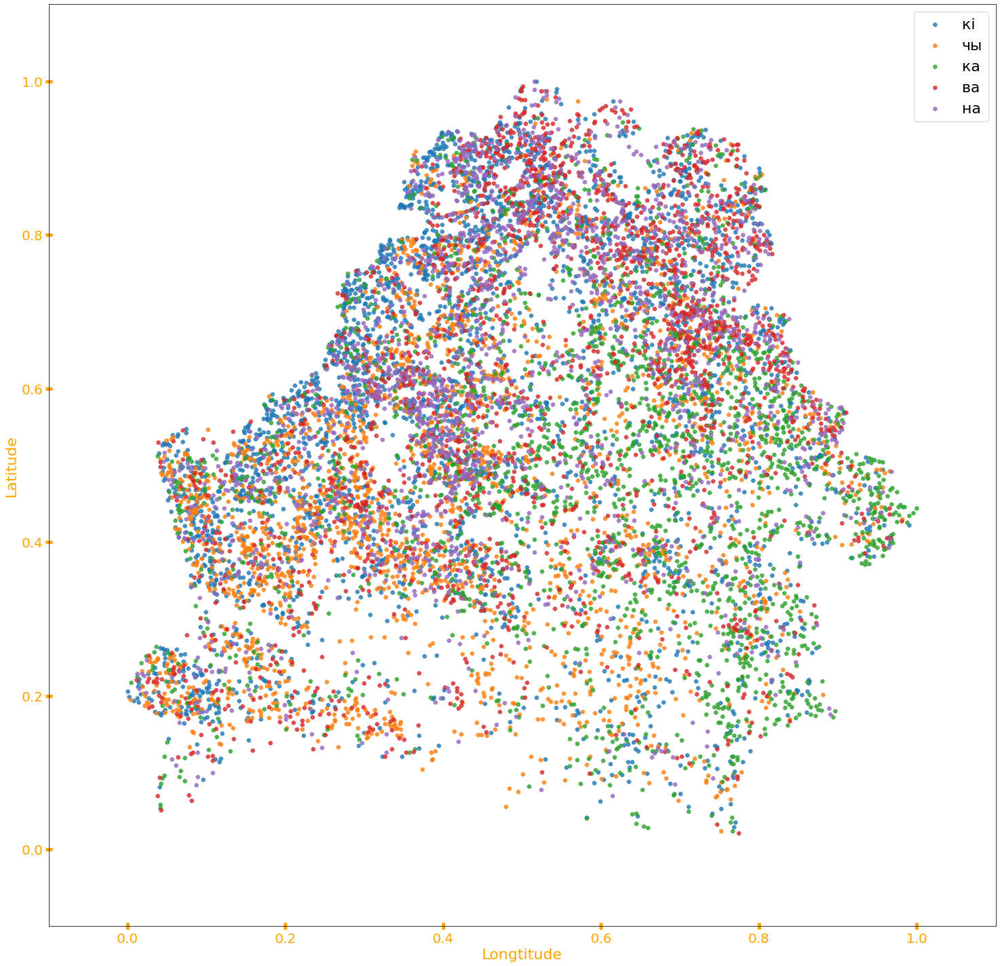
    


### Пока приведём субъктивно-визуальную оценку: явно можно выделить "более зелёный" регион у российских границ, "более красный" у латвийских границ, "более синий" у литовских и "рыженькое уплотнение" у польских. Возможно, дело в плотности городов, но всё ещё раскрас довольно дифференцированный получается.

### Как я уже говорил, можно построить карту по отдельному окончанию. Смотрите, как устроено распределение по окончанию "цы"


```python
filtered_plot(drawing_data, get_ending, ["цы"])
```


    
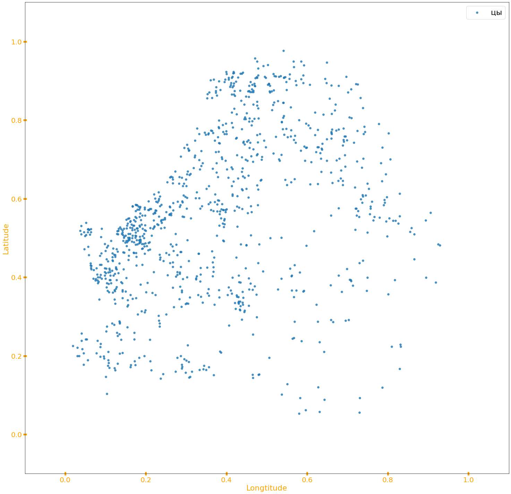
    


### Вновь визуально получаем уплотнение на границе с Литвой. Забавненько

### Давайте выделим "победителей"


```python
filtered_plot(drawing_data, get_ending, ["кі", "чы", "ка"])
```


    
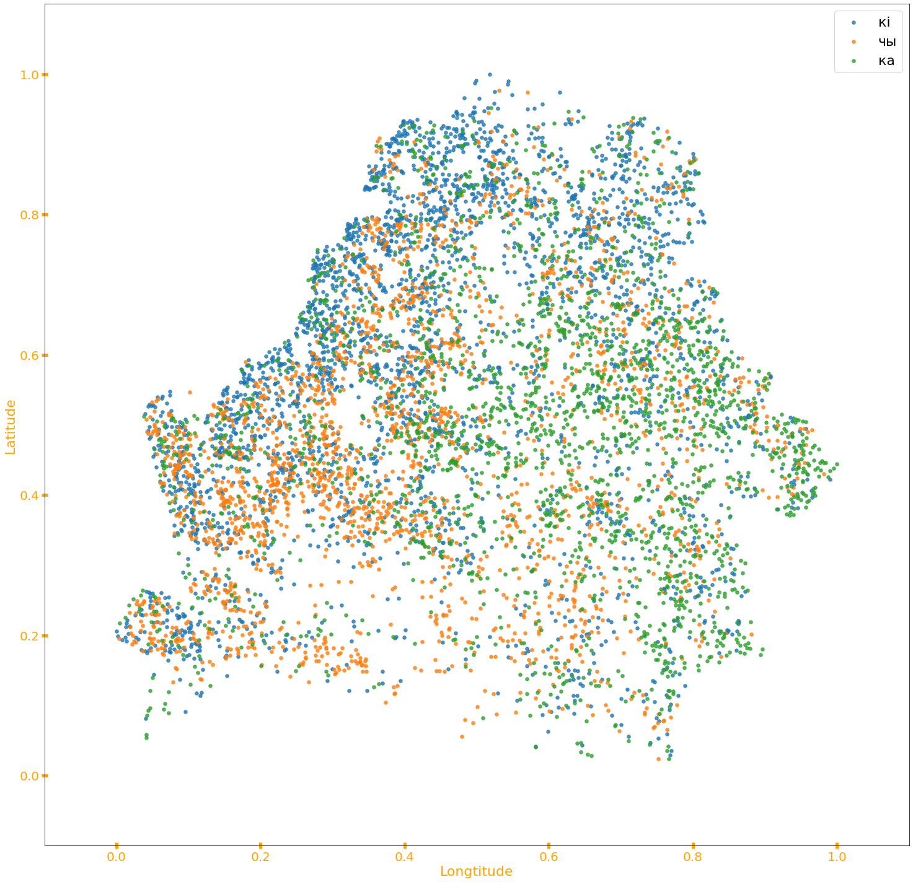
    


### У Польши "начыкано" больше :)

### Вновь же, пока всё сугубо визуально

### Давайте просто бахнем сразу все города. Получим прдеставление о плотности городов в Беларуси...согласно датасету)


```python
# для любителей экстрима
filtered_plot(drawing_data, len, range(30))
```


    
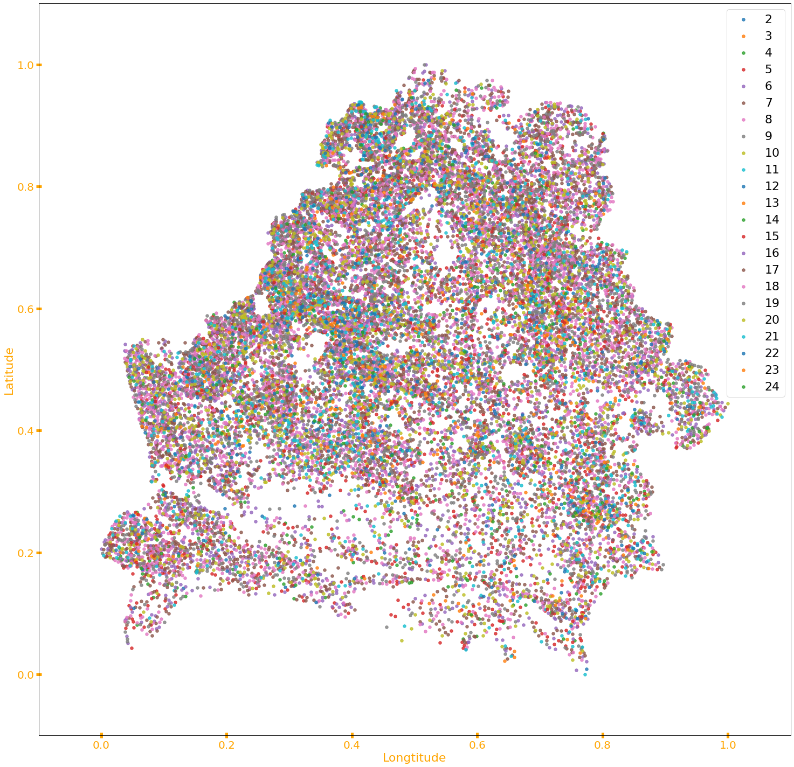
    


### Внимательный читатель заметит, что написанная мной функция может принимать не только окончания, но и любые другие уместные функции для анализа. Давайте посмотрим, где больше всего белорусы нашипилявили.


```python
def get_sh(word):
    return word.count("ш")
```


```python
filtered_plot(drawing_data, get_sh, range(1, 20))
```


    
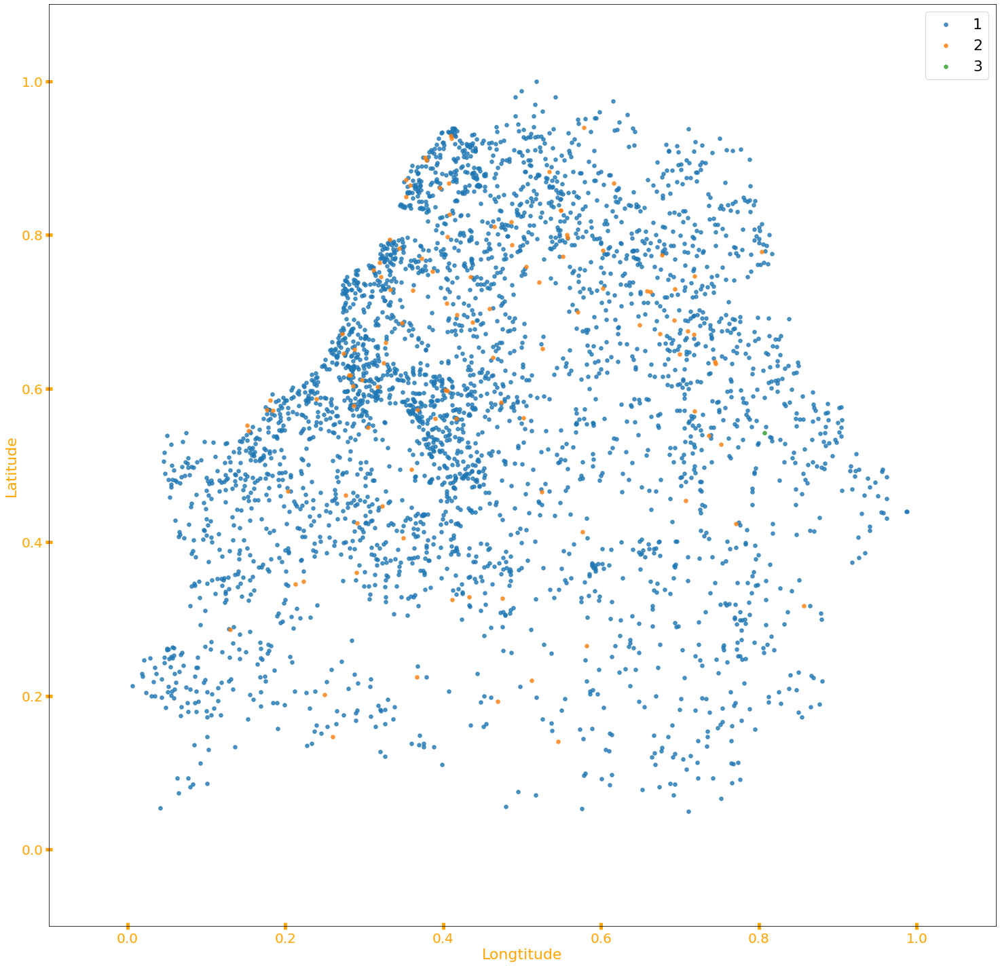
    


### Забавное уплотнение у польских и литовских границ)

### Чисто из любопытства, подробнее глянем, где тот самый город с тремя буковками ш)


```python
filtered_plot(drawing_data, get_sh, [3])
```


    
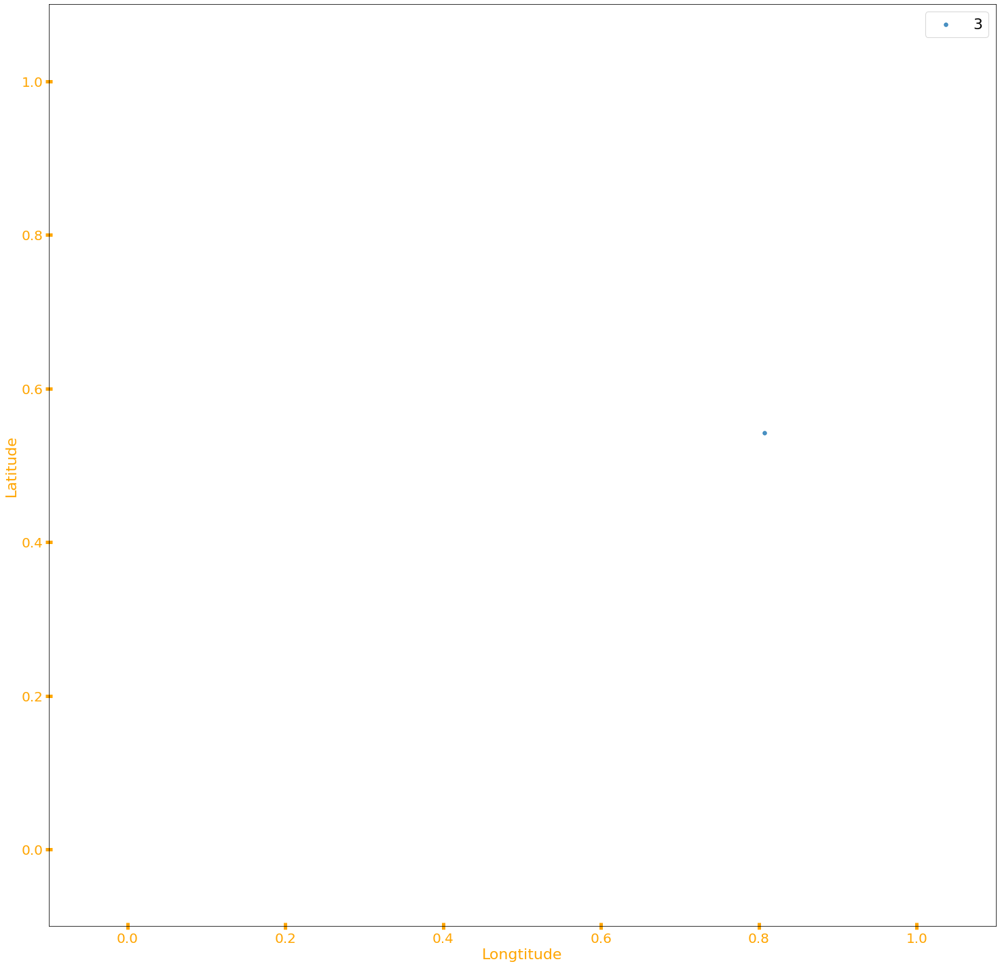
    


### Где-то там находится посёлок Зашляшша)

### Давайте ещё ради любопытства построим карту по количеству символов в названии


```python
filtered_plot(drawing_data, len, [5,6, 11, 12, 17, 18])
```


    
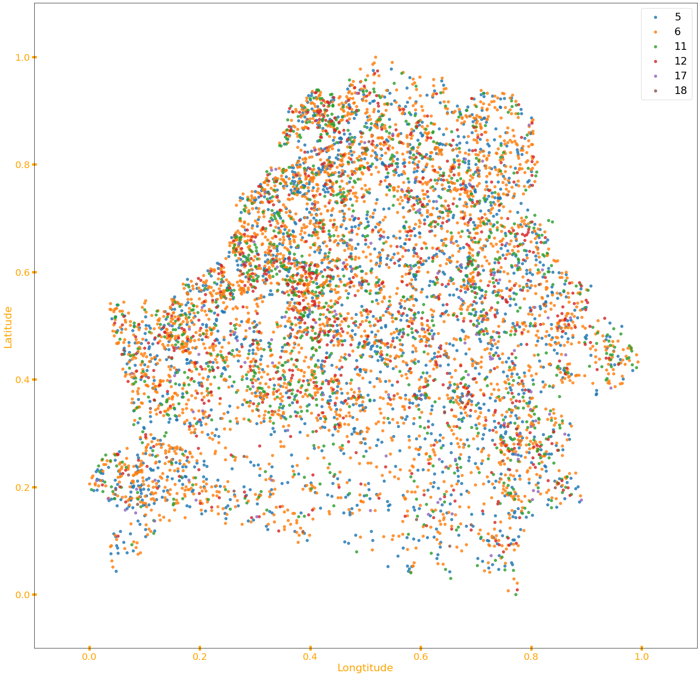
    


### Ну тут уже совсем сходу можно понять, что ГП и кол-во символов в названии почти независимы. Нет каких-то ярких групп, кроме красно-зелёного скопления к северо-западу от Минска, но думаю, и оно вызвано плотностью поселений в этом регионе.

### Ну и если совсем ~~поехать кукухой~~ нечего делать, можно глянуть на распределение по употреблению букв й и ё.


```python
def count_special_letter_1(word):
    return word.count("й")

def count_special_letter_2(word):
    return word.count("ё")

```


```python
filtered_plot(drawing_data, count_special_letter_1, range(1, 10))
```


    
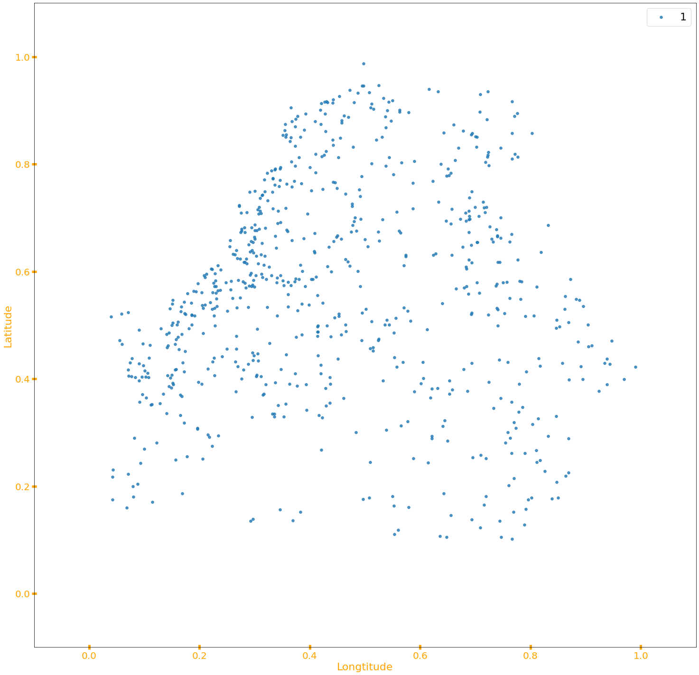
    


### йокать на границах с Литвой привычнее)


```python
filtered_plot(drawing_data, count_special_letter_2, range(1, 10))
```


    
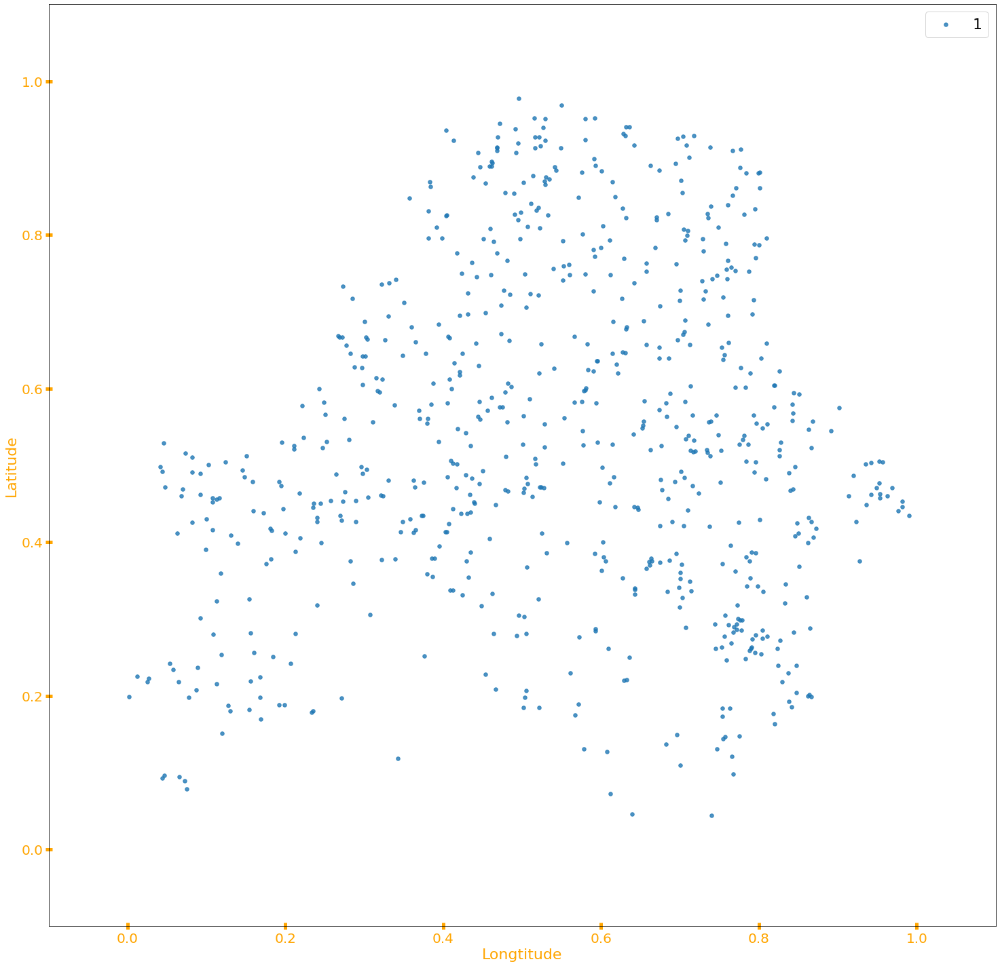
    


### А ёкать по всей стране любят...Полесье чуть халтурит только...или датасет)

### Давайте проведём все-таки какой-нибудь честный статистический анализ. Вернёмся подробнее к теме окончаний.
### Предлагаю разбить территорию нашей страны на равномерные регионы по долготе и высоте, то есть сделать, скажем,
### 29 отрезочков одинаковой длины (я буду делать только по долготе, можно аналогично и по широте) и посчитать в них количество городов с тем или иным окончанием.
### Естественно, тут может помешать различная плотность городов в регионах, поэтому будем считать "плотность городов с определённым окончанием", а именно: делить на количество всех городов в регионе.
### Это немного странно выглядит...но, видимо, это так в силу простоты и понятности подхода) Вроде бы забавно и здоровью не угрожает, значит, можно попробовать. Пробуем.


```python
number_of_regions = 29
number_of_top_endings = 10
region_markers = np.append(np.arange(0.0, 1.0, 1.0 / number_of_regions), 1.00000001)
regions = [(region_markers[i], region_markers[i + 1]) for i in range(len(region_markers) - 1)]
regions
```


    [(0.0, 0.034482758620689655),
     (0.034482758620689655, 0.06896551724137931),
     (0.06896551724137931, 0.10344827586206896),
     (0.10344827586206896, 0.13793103448275862),
     (0.13793103448275862, 0.1724137931034483),
     (0.1724137931034483, 0.20689655172413793),
     (0.20689655172413793, 0.24137931034482757),
     (0.24137931034482757, 0.27586206896551724),
     (0.27586206896551724, 0.3103448275862069),
     (0.3103448275862069, 0.3448275862068966),
     (0.3448275862068966, 0.3793103448275862),
     (0.3793103448275862, 0.41379310344827586),
     (0.41379310344827586, 0.4482758620689655),
     (0.4482758620689655, 0.48275862068965514),
     (0.48275862068965514, 0.5172413793103449),
     (0.5172413793103449, 0.5517241379310345),
     (0.5517241379310345, 0.5862068965517241),
     (0.5862068965517241, 0.6206896551724138),
     (0.6206896551724138, 0.6551724137931034),
     (0.6551724137931034, 0.6896551724137931),
     (0.6896551724137931, 0.7241379310344828),
     (0.7241379310344828, 0.7586206896551724),
     (0.7586206896551724, 0.7931034482758621),
     (0.7931034482758621, 0.8275862068965517),
     (0.8275862068965517, 0.8620689655172413),
     (0.8620689655172413, 0.896551724137931),
     (0.896551724137931, 0.9310344827586207),
     (0.9310344827586207, 0.9655172413793103),
     (0.9655172413793103, 1.00000001)]


### Подготовим датафрейм


```python
top_endings = list(blr_endings.keys())[:number_of_top_endings]
regions_data = pd.DataFrame(regions, columns=["left_border", "right_border"])
regions_data[top_endings] = 0.0
regions_data["total"] = 0
regions_data
```


<div>
<style scoped>
    .dataframe tbody tr th:only-of-type {
        vertical-align: middle;
    }

    .dataframe tbody tr th {
        vertical-align: top;
    }

    .dataframe thead th {
        text-align: right;
    }
</style>
<table border="1" class="dataframe">
  <thead>
    <tr style="text-align: right;">
      <th></th>
      <th>left_border</th>
      <th>right_border</th>
      <th>кі</th>
      <th>чы</th>
      <th>ка</th>
      <th>ва</th>
      <th>на</th>
      <th>цы</th>
      <th>ны</th>
      <th>ча</th>
      <th>ца</th>
      <th>ае</th>
      <th>total</th>
    </tr>
  </thead>
  <tbody>
    <tr>
      <th>0</th>
      <td>0.000000</td>
      <td>0.034483</td>
      <td>0.0</td>
      <td>0.0</td>
      <td>0.0</td>
      <td>0.0</td>
      <td>0.0</td>
      <td>0.0</td>
      <td>0.0</td>
      <td>0.0</td>
      <td>0.0</td>
      <td>0.0</td>
      <td>0</td>
    </tr>
    <tr>
      <th>1</th>
      <td>0.034483</td>
      <td>0.068966</td>
      <td>0.0</td>
      <td>0.0</td>
      <td>0.0</td>
      <td>0.0</td>
      <td>0.0</td>
      <td>0.0</td>
      <td>0.0</td>
      <td>0.0</td>
      <td>0.0</td>
      <td>0.0</td>
      <td>0</td>
    </tr>
    <tr>
      <th>2</th>
      <td>0.068966</td>
      <td>0.103448</td>
      <td>0.0</td>
      <td>0.0</td>
      <td>0.0</td>
      <td>0.0</td>
      <td>0.0</td>
      <td>0.0</td>
      <td>0.0</td>
      <td>0.0</td>
      <td>0.0</td>
      <td>0.0</td>
      <td>0</td>
    </tr>
    <tr>
      <th>3</th>
      <td>0.103448</td>
      <td>0.137931</td>
      <td>0.0</td>
      <td>0.0</td>
      <td>0.0</td>
      <td>0.0</td>
      <td>0.0</td>
      <td>0.0</td>
      <td>0.0</td>
      <td>0.0</td>
      <td>0.0</td>
      <td>0.0</td>
      <td>0</td>
    </tr>
    <tr>
      <th>4</th>
      <td>0.137931</td>
      <td>0.172414</td>
      <td>0.0</td>
      <td>0.0</td>
      <td>0.0</td>
      <td>0.0</td>
      <td>0.0</td>
      <td>0.0</td>
      <td>0.0</td>
      <td>0.0</td>
      <td>0.0</td>
      <td>0.0</td>
      <td>0</td>
    </tr>
    <tr>
      <th>5</th>
      <td>0.172414</td>
      <td>0.206897</td>
      <td>0.0</td>
      <td>0.0</td>
      <td>0.0</td>
      <td>0.0</td>
      <td>0.0</td>
      <td>0.0</td>
      <td>0.0</td>
      <td>0.0</td>
      <td>0.0</td>
      <td>0.0</td>
      <td>0</td>
    </tr>
    <tr>
      <th>6</th>
      <td>0.206897</td>
      <td>0.241379</td>
      <td>0.0</td>
      <td>0.0</td>
      <td>0.0</td>
      <td>0.0</td>
      <td>0.0</td>
      <td>0.0</td>
      <td>0.0</td>
      <td>0.0</td>
      <td>0.0</td>
      <td>0.0</td>
      <td>0</td>
    </tr>
    <tr>
      <th>7</th>
      <td>0.241379</td>
      <td>0.275862</td>
      <td>0.0</td>
      <td>0.0</td>
      <td>0.0</td>
      <td>0.0</td>
      <td>0.0</td>
      <td>0.0</td>
      <td>0.0</td>
      <td>0.0</td>
      <td>0.0</td>
      <td>0.0</td>
      <td>0</td>
    </tr>
    <tr>
      <th>8</th>
      <td>0.275862</td>
      <td>0.310345</td>
      <td>0.0</td>
      <td>0.0</td>
      <td>0.0</td>
      <td>0.0</td>
      <td>0.0</td>
      <td>0.0</td>
      <td>0.0</td>
      <td>0.0</td>
      <td>0.0</td>
      <td>0.0</td>
      <td>0</td>
    </tr>
    <tr>
      <th>9</th>
      <td>0.310345</td>
      <td>0.344828</td>
      <td>0.0</td>
      <td>0.0</td>
      <td>0.0</td>
      <td>0.0</td>
      <td>0.0</td>
      <td>0.0</td>
      <td>0.0</td>
      <td>0.0</td>
      <td>0.0</td>
      <td>0.0</td>
      <td>0</td>
    </tr>
    <tr>
      <th>10</th>
      <td>0.344828</td>
      <td>0.379310</td>
      <td>0.0</td>
      <td>0.0</td>
      <td>0.0</td>
      <td>0.0</td>
      <td>0.0</td>
      <td>0.0</td>
      <td>0.0</td>
      <td>0.0</td>
      <td>0.0</td>
      <td>0.0</td>
      <td>0</td>
    </tr>
    <tr>
      <th>11</th>
      <td>0.379310</td>
      <td>0.413793</td>
      <td>0.0</td>
      <td>0.0</td>
      <td>0.0</td>
      <td>0.0</td>
      <td>0.0</td>
      <td>0.0</td>
      <td>0.0</td>
      <td>0.0</td>
      <td>0.0</td>
      <td>0.0</td>
      <td>0</td>
    </tr>
    <tr>
      <th>12</th>
      <td>0.413793</td>
      <td>0.448276</td>
      <td>0.0</td>
      <td>0.0</td>
      <td>0.0</td>
      <td>0.0</td>
      <td>0.0</td>
      <td>0.0</td>
      <td>0.0</td>
      <td>0.0</td>
      <td>0.0</td>
      <td>0.0</td>
      <td>0</td>
    </tr>
    <tr>
      <th>13</th>
      <td>0.448276</td>
      <td>0.482759</td>
      <td>0.0</td>
      <td>0.0</td>
      <td>0.0</td>
      <td>0.0</td>
      <td>0.0</td>
      <td>0.0</td>
      <td>0.0</td>
      <td>0.0</td>
      <td>0.0</td>
      <td>0.0</td>
      <td>0</td>
    </tr>
    <tr>
      <th>14</th>
      <td>0.482759</td>
      <td>0.517241</td>
      <td>0.0</td>
      <td>0.0</td>
      <td>0.0</td>
      <td>0.0</td>
      <td>0.0</td>
      <td>0.0</td>
      <td>0.0</td>
      <td>0.0</td>
      <td>0.0</td>
      <td>0.0</td>
      <td>0</td>
    </tr>
    <tr>
      <th>15</th>
      <td>0.517241</td>
      <td>0.551724</td>
      <td>0.0</td>
      <td>0.0</td>
      <td>0.0</td>
      <td>0.0</td>
      <td>0.0</td>
      <td>0.0</td>
      <td>0.0</td>
      <td>0.0</td>
      <td>0.0</td>
      <td>0.0</td>
      <td>0</td>
    </tr>
    <tr>
      <th>16</th>
      <td>0.551724</td>
      <td>0.586207</td>
      <td>0.0</td>
      <td>0.0</td>
      <td>0.0</td>
      <td>0.0</td>
      <td>0.0</td>
      <td>0.0</td>
      <td>0.0</td>
      <td>0.0</td>
      <td>0.0</td>
      <td>0.0</td>
      <td>0</td>
    </tr>
    <tr>
      <th>17</th>
      <td>0.586207</td>
      <td>0.620690</td>
      <td>0.0</td>
      <td>0.0</td>
      <td>0.0</td>
      <td>0.0</td>
      <td>0.0</td>
      <td>0.0</td>
      <td>0.0</td>
      <td>0.0</td>
      <td>0.0</td>
      <td>0.0</td>
      <td>0</td>
    </tr>
    <tr>
      <th>18</th>
      <td>0.620690</td>
      <td>0.655172</td>
      <td>0.0</td>
      <td>0.0</td>
      <td>0.0</td>
      <td>0.0</td>
      <td>0.0</td>
      <td>0.0</td>
      <td>0.0</td>
      <td>0.0</td>
      <td>0.0</td>
      <td>0.0</td>
      <td>0</td>
    </tr>
    <tr>
      <th>19</th>
      <td>0.655172</td>
      <td>0.689655</td>
      <td>0.0</td>
      <td>0.0</td>
      <td>0.0</td>
      <td>0.0</td>
      <td>0.0</td>
      <td>0.0</td>
      <td>0.0</td>
      <td>0.0</td>
      <td>0.0</td>
      <td>0.0</td>
      <td>0</td>
    </tr>
    <tr>
      <th>20</th>
      <td>0.689655</td>
      <td>0.724138</td>
      <td>0.0</td>
      <td>0.0</td>
      <td>0.0</td>
      <td>0.0</td>
      <td>0.0</td>
      <td>0.0</td>
      <td>0.0</td>
      <td>0.0</td>
      <td>0.0</td>
      <td>0.0</td>
      <td>0</td>
    </tr>
    <tr>
      <th>21</th>
      <td>0.724138</td>
      <td>0.758621</td>
      <td>0.0</td>
      <td>0.0</td>
      <td>0.0</td>
      <td>0.0</td>
      <td>0.0</td>
      <td>0.0</td>
      <td>0.0</td>
      <td>0.0</td>
      <td>0.0</td>
      <td>0.0</td>
      <td>0</td>
    </tr>
    <tr>
      <th>22</th>
      <td>0.758621</td>
      <td>0.793103</td>
      <td>0.0</td>
      <td>0.0</td>
      <td>0.0</td>
      <td>0.0</td>
      <td>0.0</td>
      <td>0.0</td>
      <td>0.0</td>
      <td>0.0</td>
      <td>0.0</td>
      <td>0.0</td>
      <td>0</td>
    </tr>
    <tr>
      <th>23</th>
      <td>0.793103</td>
      <td>0.827586</td>
      <td>0.0</td>
      <td>0.0</td>
      <td>0.0</td>
      <td>0.0</td>
      <td>0.0</td>
      <td>0.0</td>
      <td>0.0</td>
      <td>0.0</td>
      <td>0.0</td>
      <td>0.0</td>
      <td>0</td>
    </tr>
    <tr>
      <th>24</th>
      <td>0.827586</td>
      <td>0.862069</td>
      <td>0.0</td>
      <td>0.0</td>
      <td>0.0</td>
      <td>0.0</td>
      <td>0.0</td>
      <td>0.0</td>
      <td>0.0</td>
      <td>0.0</td>
      <td>0.0</td>
      <td>0.0</td>
      <td>0</td>
    </tr>
    <tr>
      <th>25</th>
      <td>0.862069</td>
      <td>0.896552</td>
      <td>0.0</td>
      <td>0.0</td>
      <td>0.0</td>
      <td>0.0</td>
      <td>0.0</td>
      <td>0.0</td>
      <td>0.0</td>
      <td>0.0</td>
      <td>0.0</td>
      <td>0.0</td>
      <td>0</td>
    </tr>
    <tr>
      <th>26</th>
      <td>0.896552</td>
      <td>0.931034</td>
      <td>0.0</td>
      <td>0.0</td>
      <td>0.0</td>
      <td>0.0</td>
      <td>0.0</td>
      <td>0.0</td>
      <td>0.0</td>
      <td>0.0</td>
      <td>0.0</td>
      <td>0.0</td>
      <td>0</td>
    </tr>
    <tr>
      <th>27</th>
      <td>0.931034</td>
      <td>0.965517</td>
      <td>0.0</td>
      <td>0.0</td>
      <td>0.0</td>
      <td>0.0</td>
      <td>0.0</td>
      <td>0.0</td>
      <td>0.0</td>
      <td>0.0</td>
      <td>0.0</td>
      <td>0.0</td>
      <td>0</td>
    </tr>
    <tr>
      <th>28</th>
      <td>0.965517</td>
      <td>1.000000</td>
      <td>0.0</td>
      <td>0.0</td>
      <td>0.0</td>
      <td>0.0</td>
      <td>0.0</td>
      <td>0.0</td>
      <td>0.0</td>
      <td>0.0</td>
      <td>0.0</td>
      <td>0.0</td>
      <td>0</td>
    </tr>
  </tbody>
</table>
</div>


### Теперь пройдёмся по нашим данным и высчитаем плотность для каждого окончания


```python
for index in data.index:
    ending = get_ending(data.at[index, "blr_name"])
    if ending not in top_endings:
        continue
    longtitude = data.at[index, "scaled_longtitude"]
    regions_data.loc[(regions_data["left_border"] <= longtitude) & (regions_data["right_border"] > longtitude), "total"] += 1
    regions_data.loc[(regions_data["left_border"] <= longtitude) & (regions_data["right_border"] > longtitude), ending] += 1.0
for index in regions_data.index:
    total = regions_data.at[index, "total"]
    for ending_ in top_endings:
        regions_data.at[index, ending_] /= total
regions_data
```


<div>
<style scoped>
    .dataframe tbody tr th:only-of-type {
        vertical-align: middle;
    }

    .dataframe tbody tr th {
        vertical-align: top;
    }

    .dataframe thead th {
        text-align: right;
    }
</style>
<table border="1" class="dataframe">
  <thead>
    <tr style="text-align: right;">
      <th></th>
      <th>left_border</th>
      <th>right_border</th>
      <th>кі</th>
      <th>чы</th>
      <th>ка</th>
      <th>ва</th>
      <th>на</th>
      <th>цы</th>
      <th>ны</th>
      <th>ча</th>
      <th>ца</th>
      <th>ае</th>
      <th>total</th>
    </tr>
  </thead>
  <tbody>
    <tr>
      <th>0</th>
      <td>0.000000</td>
      <td>0.034483</td>
      <td>0.258065</td>
      <td>0.225806</td>
      <td>0.112903</td>
      <td>0.112903</td>
      <td>0.096774</td>
      <td>0.064516</td>
      <td>0.000000</td>
      <td>0.080645</td>
      <td>0.032258</td>
      <td>0.016129</td>
      <td>62</td>
    </tr>
    <tr>
      <th>1</th>
      <td>0.034483</td>
      <td>0.068966</td>
      <td>0.223443</td>
      <td>0.238095</td>
      <td>0.131868</td>
      <td>0.091575</td>
      <td>0.058608</td>
      <td>0.113553</td>
      <td>0.084249</td>
      <td>0.018315</td>
      <td>0.032967</td>
      <td>0.007326</td>
      <td>273</td>
    </tr>
    <tr>
      <th>2</th>
      <td>0.068966</td>
      <td>0.103448</td>
      <td>0.280269</td>
      <td>0.199552</td>
      <td>0.076233</td>
      <td>0.100897</td>
      <td>0.076233</td>
      <td>0.094170</td>
      <td>0.100897</td>
      <td>0.015695</td>
      <td>0.035874</td>
      <td>0.020179</td>
      <td>446</td>
    </tr>
    <tr>
      <th>3</th>
      <td>0.103448</td>
      <td>0.137931</td>
      <td>0.254364</td>
      <td>0.192020</td>
      <td>0.067332</td>
      <td>0.084788</td>
      <td>0.089776</td>
      <td>0.159601</td>
      <td>0.087282</td>
      <td>0.012469</td>
      <td>0.037406</td>
      <td>0.014963</td>
      <td>401</td>
    </tr>
    <tr>
      <th>4</th>
      <td>0.137931</td>
      <td>0.172414</td>
      <td>0.273913</td>
      <td>0.254348</td>
      <td>0.082609</td>
      <td>0.056522</td>
      <td>0.076087</td>
      <td>0.156522</td>
      <td>0.060870</td>
      <td>0.010870</td>
      <td>0.015217</td>
      <td>0.013043</td>
      <td>460</td>
    </tr>
    <tr>
      <th>5</th>
      <td>0.172414</td>
      <td>0.206897</td>
      <td>0.244292</td>
      <td>0.244292</td>
      <td>0.089041</td>
      <td>0.084475</td>
      <td>0.075342</td>
      <td>0.168950</td>
      <td>0.052511</td>
      <td>0.018265</td>
      <td>0.018265</td>
      <td>0.004566</td>
      <td>438</td>
    </tr>
    <tr>
      <th>6</th>
      <td>0.206897</td>
      <td>0.241379</td>
      <td>0.274775</td>
      <td>0.231982</td>
      <td>0.040541</td>
      <td>0.117117</td>
      <td>0.078829</td>
      <td>0.105856</td>
      <td>0.103604</td>
      <td>0.029279</td>
      <td>0.015766</td>
      <td>0.002252</td>
      <td>444</td>
    </tr>
    <tr>
      <th>7</th>
      <td>0.241379</td>
      <td>0.275862</td>
      <td>0.273942</td>
      <td>0.189310</td>
      <td>0.102450</td>
      <td>0.113586</td>
      <td>0.115813</td>
      <td>0.084633</td>
      <td>0.082405</td>
      <td>0.013363</td>
      <td>0.017817</td>
      <td>0.006682</td>
      <td>449</td>
    </tr>
    <tr>
      <th>8</th>
      <td>0.275862</td>
      <td>0.310345</td>
      <td>0.240642</td>
      <td>0.201872</td>
      <td>0.073529</td>
      <td>0.097594</td>
      <td>0.110963</td>
      <td>0.080214</td>
      <td>0.131016</td>
      <td>0.038770</td>
      <td>0.024064</td>
      <td>0.001337</td>
      <td>748</td>
    </tr>
    <tr>
      <th>9</th>
      <td>0.310345</td>
      <td>0.344828</td>
      <td>0.281570</td>
      <td>0.211604</td>
      <td>0.064846</td>
      <td>0.104096</td>
      <td>0.122867</td>
      <td>0.056314</td>
      <td>0.092150</td>
      <td>0.037543</td>
      <td>0.015358</td>
      <td>0.013652</td>
      <td>586</td>
    </tr>
    <tr>
      <th>10</th>
      <td>0.344828</td>
      <td>0.379310</td>
      <td>0.249664</td>
      <td>0.194631</td>
      <td>0.063087</td>
      <td>0.100671</td>
      <td>0.173154</td>
      <td>0.067114</td>
      <td>0.075168</td>
      <td>0.033557</td>
      <td>0.022819</td>
      <td>0.020134</td>
      <td>745</td>
    </tr>
    <tr>
      <th>11</th>
      <td>0.379310</td>
      <td>0.413793</td>
      <td>0.245958</td>
      <td>0.172055</td>
      <td>0.081986</td>
      <td>0.109700</td>
      <td>0.193995</td>
      <td>0.071594</td>
      <td>0.062356</td>
      <td>0.021940</td>
      <td>0.017321</td>
      <td>0.023095</td>
      <td>866</td>
    </tr>
    <tr>
      <th>12</th>
      <td>0.413793</td>
      <td>0.448276</td>
      <td>0.222892</td>
      <td>0.130522</td>
      <td>0.123494</td>
      <td>0.127510</td>
      <td>0.202811</td>
      <td>0.077309</td>
      <td>0.046185</td>
      <td>0.027108</td>
      <td>0.019076</td>
      <td>0.023092</td>
      <td>996</td>
    </tr>
    <tr>
      <th>13</th>
      <td>0.448276</td>
      <td>0.482759</td>
      <td>0.212411</td>
      <td>0.137232</td>
      <td>0.120525</td>
      <td>0.164678</td>
      <td>0.130072</td>
      <td>0.085919</td>
      <td>0.051313</td>
      <td>0.053699</td>
      <td>0.022673</td>
      <td>0.021480</td>
      <td>838</td>
    </tr>
    <tr>
      <th>14</th>
      <td>0.482759</td>
      <td>0.517241</td>
      <td>0.191395</td>
      <td>0.102374</td>
      <td>0.143917</td>
      <td>0.201780</td>
      <td>0.140950</td>
      <td>0.035608</td>
      <td>0.028190</td>
      <td>0.071217</td>
      <td>0.034125</td>
      <td>0.050445</td>
      <td>674</td>
    </tr>
    <tr>
      <th>15</th>
      <td>0.517241</td>
      <td>0.551724</td>
      <td>0.188742</td>
      <td>0.107616</td>
      <td>0.142384</td>
      <td>0.185430</td>
      <td>0.150662</td>
      <td>0.056291</td>
      <td>0.034768</td>
      <td>0.062914</td>
      <td>0.031457</td>
      <td>0.039735</td>
      <td>604</td>
    </tr>
    <tr>
      <th>16</th>
      <td>0.551724</td>
      <td>0.586207</td>
      <td>0.158070</td>
      <td>0.123128</td>
      <td>0.183028</td>
      <td>0.138103</td>
      <td>0.134775</td>
      <td>0.053245</td>
      <td>0.031614</td>
      <td>0.084859</td>
      <td>0.046589</td>
      <td>0.046589</td>
      <td>601</td>
    </tr>
    <tr>
      <th>17</th>
      <td>0.586207</td>
      <td>0.620690</td>
      <td>0.141566</td>
      <td>0.117470</td>
      <td>0.212349</td>
      <td>0.149096</td>
      <td>0.155120</td>
      <td>0.030120</td>
      <td>0.037651</td>
      <td>0.058735</td>
      <td>0.052711</td>
      <td>0.045181</td>
      <td>664</td>
    </tr>
    <tr>
      <th>18</th>
      <td>0.620690</td>
      <td>0.655172</td>
      <td>0.181090</td>
      <td>0.136218</td>
      <td>0.213141</td>
      <td>0.161859</td>
      <td>0.113782</td>
      <td>0.038462</td>
      <td>0.040064</td>
      <td>0.056090</td>
      <td>0.035256</td>
      <td>0.024038</td>
      <td>624</td>
    </tr>
    <tr>
      <th>19</th>
      <td>0.655172</td>
      <td>0.689655</td>
      <td>0.188218</td>
      <td>0.139368</td>
      <td>0.191092</td>
      <td>0.150862</td>
      <td>0.120690</td>
      <td>0.044540</td>
      <td>0.027299</td>
      <td>0.067529</td>
      <td>0.040230</td>
      <td>0.030172</td>
      <td>696</td>
    </tr>
    <tr>
      <th>20</th>
      <td>0.689655</td>
      <td>0.724138</td>
      <td>0.192308</td>
      <td>0.087533</td>
      <td>0.184350</td>
      <td>0.234748</td>
      <td>0.131300</td>
      <td>0.035809</td>
      <td>0.034483</td>
      <td>0.039788</td>
      <td>0.022546</td>
      <td>0.037135</td>
      <td>754</td>
    </tr>
    <tr>
      <th>21</th>
      <td>0.724138</td>
      <td>0.758621</td>
      <td>0.170915</td>
      <td>0.095952</td>
      <td>0.211394</td>
      <td>0.209895</td>
      <td>0.124438</td>
      <td>0.041979</td>
      <td>0.032984</td>
      <td>0.043478</td>
      <td>0.028486</td>
      <td>0.040480</td>
      <td>667</td>
    </tr>
    <tr>
      <th>22</th>
      <td>0.758621</td>
      <td>0.793103</td>
      <td>0.156495</td>
      <td>0.111111</td>
      <td>0.272300</td>
      <td>0.190923</td>
      <td>0.111111</td>
      <td>0.018779</td>
      <td>0.026604</td>
      <td>0.062598</td>
      <td>0.031299</td>
      <td>0.018779</td>
      <td>639</td>
    </tr>
    <tr>
      <th>23</th>
      <td>0.793103</td>
      <td>0.827586</td>
      <td>0.176471</td>
      <td>0.100840</td>
      <td>0.283613</td>
      <td>0.130252</td>
      <td>0.142857</td>
      <td>0.027311</td>
      <td>0.054622</td>
      <td>0.031513</td>
      <td>0.023109</td>
      <td>0.029412</td>
      <td>476</td>
    </tr>
    <tr>
      <th>24</th>
      <td>0.827586</td>
      <td>0.862069</td>
      <td>0.173759</td>
      <td>0.060284</td>
      <td>0.368794</td>
      <td>0.163121</td>
      <td>0.088652</td>
      <td>0.024823</td>
      <td>0.039007</td>
      <td>0.049645</td>
      <td>0.010638</td>
      <td>0.021277</td>
      <td>282</td>
    </tr>
    <tr>
      <th>25</th>
      <td>0.862069</td>
      <td>0.896552</td>
      <td>0.184358</td>
      <td>0.117318</td>
      <td>0.273743</td>
      <td>0.128492</td>
      <td>0.162011</td>
      <td>0.022346</td>
      <td>0.022346</td>
      <td>0.033520</td>
      <td>0.022346</td>
      <td>0.033520</td>
      <td>179</td>
    </tr>
    <tr>
      <th>26</th>
      <td>0.896552</td>
      <td>0.931034</td>
      <td>0.077670</td>
      <td>0.194175</td>
      <td>0.339806</td>
      <td>0.126214</td>
      <td>0.106796</td>
      <td>0.038835</td>
      <td>0.009709</td>
      <td>0.038835</td>
      <td>0.029126</td>
      <td>0.038835</td>
      <td>103</td>
    </tr>
    <tr>
      <th>27</th>
      <td>0.931034</td>
      <td>0.965517</td>
      <td>0.149123</td>
      <td>0.122807</td>
      <td>0.535088</td>
      <td>0.061404</td>
      <td>0.061404</td>
      <td>0.000000</td>
      <td>0.008772</td>
      <td>0.017544</td>
      <td>0.000000</td>
      <td>0.043860</td>
      <td>114</td>
    </tr>
    <tr>
      <th>28</th>
      <td>0.965517</td>
      <td>1.000000</td>
      <td>0.035714</td>
      <td>0.035714</td>
      <td>0.750000</td>
      <td>0.071429</td>
      <td>0.071429</td>
      <td>0.000000</td>
      <td>0.035714</td>
      <td>0.000000</td>
      <td>0.000000</td>
      <td>0.000000</td>
      <td>28</td>
    </tr>
  </tbody>
</table>
</div>


### Давайте теперь дадим каждому региону среднее значение долготы (ср. арифм.) и высчитаем коэффициент корреляции Пирсона для каждого из окончаний (доля городов с данным окончанием в регионе к средней долготе региона)


```python
regions_data["average_longtitude"] = (regions_data["left_border"] + regions_data["right_border"]) / 2
regions_data
```


<div>
<style scoped>
    .dataframe tbody tr th:only-of-type {
        vertical-align: middle;
    }

    .dataframe tbody tr th {
        vertical-align: top;
    }

    .dataframe thead th {
        text-align: right;
    }
</style>
<table border="1" class="dataframe">
  <thead>
    <tr style="text-align: right;">
      <th></th>
      <th>left_border</th>
      <th>right_border</th>
      <th>кі</th>
      <th>чы</th>
      <th>ка</th>
      <th>ва</th>
      <th>на</th>
      <th>цы</th>
      <th>ны</th>
      <th>ча</th>
      <th>ца</th>
      <th>ае</th>
      <th>total</th>
      <th>average_longtitude</th>
    </tr>
  </thead>
  <tbody>
    <tr>
      <th>0</th>
      <td>0.000000</td>
      <td>0.034483</td>
      <td>0.258065</td>
      <td>0.225806</td>
      <td>0.112903</td>
      <td>0.112903</td>
      <td>0.096774</td>
      <td>0.064516</td>
      <td>0.000000</td>
      <td>0.080645</td>
      <td>0.032258</td>
      <td>0.016129</td>
      <td>62</td>
      <td>0.017241</td>
    </tr>
    <tr>
      <th>1</th>
      <td>0.034483</td>
      <td>0.068966</td>
      <td>0.223443</td>
      <td>0.238095</td>
      <td>0.131868</td>
      <td>0.091575</td>
      <td>0.058608</td>
      <td>0.113553</td>
      <td>0.084249</td>
      <td>0.018315</td>
      <td>0.032967</td>
      <td>0.007326</td>
      <td>273</td>
      <td>0.051724</td>
    </tr>
    <tr>
      <th>2</th>
      <td>0.068966</td>
      <td>0.103448</td>
      <td>0.280269</td>
      <td>0.199552</td>
      <td>0.076233</td>
      <td>0.100897</td>
      <td>0.076233</td>
      <td>0.094170</td>
      <td>0.100897</td>
      <td>0.015695</td>
      <td>0.035874</td>
      <td>0.020179</td>
      <td>446</td>
      <td>0.086207</td>
    </tr>
    <tr>
      <th>3</th>
      <td>0.103448</td>
      <td>0.137931</td>
      <td>0.254364</td>
      <td>0.192020</td>
      <td>0.067332</td>
      <td>0.084788</td>
      <td>0.089776</td>
      <td>0.159601</td>
      <td>0.087282</td>
      <td>0.012469</td>
      <td>0.037406</td>
      <td>0.014963</td>
      <td>401</td>
      <td>0.120690</td>
    </tr>
    <tr>
      <th>4</th>
      <td>0.137931</td>
      <td>0.172414</td>
      <td>0.273913</td>
      <td>0.254348</td>
      <td>0.082609</td>
      <td>0.056522</td>
      <td>0.076087</td>
      <td>0.156522</td>
      <td>0.060870</td>
      <td>0.010870</td>
      <td>0.015217</td>
      <td>0.013043</td>
      <td>460</td>
      <td>0.155172</td>
    </tr>
    <tr>
      <th>5</th>
      <td>0.172414</td>
      <td>0.206897</td>
      <td>0.244292</td>
      <td>0.244292</td>
      <td>0.089041</td>
      <td>0.084475</td>
      <td>0.075342</td>
      <td>0.168950</td>
      <td>0.052511</td>
      <td>0.018265</td>
      <td>0.018265</td>
      <td>0.004566</td>
      <td>438</td>
      <td>0.189655</td>
    </tr>
    <tr>
      <th>6</th>
      <td>0.206897</td>
      <td>0.241379</td>
      <td>0.274775</td>
      <td>0.231982</td>
      <td>0.040541</td>
      <td>0.117117</td>
      <td>0.078829</td>
      <td>0.105856</td>
      <td>0.103604</td>
      <td>0.029279</td>
      <td>0.015766</td>
      <td>0.002252</td>
      <td>444</td>
      <td>0.224138</td>
    </tr>
    <tr>
      <th>7</th>
      <td>0.241379</td>
      <td>0.275862</td>
      <td>0.273942</td>
      <td>0.189310</td>
      <td>0.102450</td>
      <td>0.113586</td>
      <td>0.115813</td>
      <td>0.084633</td>
      <td>0.082405</td>
      <td>0.013363</td>
      <td>0.017817</td>
      <td>0.006682</td>
      <td>449</td>
      <td>0.258621</td>
    </tr>
    <tr>
      <th>8</th>
      <td>0.275862</td>
      <td>0.310345</td>
      <td>0.240642</td>
      <td>0.201872</td>
      <td>0.073529</td>
      <td>0.097594</td>
      <td>0.110963</td>
      <td>0.080214</td>
      <td>0.131016</td>
      <td>0.038770</td>
      <td>0.024064</td>
      <td>0.001337</td>
      <td>748</td>
      <td>0.293103</td>
    </tr>
    <tr>
      <th>9</th>
      <td>0.310345</td>
      <td>0.344828</td>
      <td>0.281570</td>
      <td>0.211604</td>
      <td>0.064846</td>
      <td>0.104096</td>
      <td>0.122867</td>
      <td>0.056314</td>
      <td>0.092150</td>
      <td>0.037543</td>
      <td>0.015358</td>
      <td>0.013652</td>
      <td>586</td>
      <td>0.327586</td>
    </tr>
    <tr>
      <th>10</th>
      <td>0.344828</td>
      <td>0.379310</td>
      <td>0.249664</td>
      <td>0.194631</td>
      <td>0.063087</td>
      <td>0.100671</td>
      <td>0.173154</td>
      <td>0.067114</td>
      <td>0.075168</td>
      <td>0.033557</td>
      <td>0.022819</td>
      <td>0.020134</td>
      <td>745</td>
      <td>0.362069</td>
    </tr>
    <tr>
      <th>11</th>
      <td>0.379310</td>
      <td>0.413793</td>
      <td>0.245958</td>
      <td>0.172055</td>
      <td>0.081986</td>
      <td>0.109700</td>
      <td>0.193995</td>
      <td>0.071594</td>
      <td>0.062356</td>
      <td>0.021940</td>
      <td>0.017321</td>
      <td>0.023095</td>
      <td>866</td>
      <td>0.396552</td>
    </tr>
    <tr>
      <th>12</th>
      <td>0.413793</td>
      <td>0.448276</td>
      <td>0.222892</td>
      <td>0.130522</td>
      <td>0.123494</td>
      <td>0.127510</td>
      <td>0.202811</td>
      <td>0.077309</td>
      <td>0.046185</td>
      <td>0.027108</td>
      <td>0.019076</td>
      <td>0.023092</td>
      <td>996</td>
      <td>0.431034</td>
    </tr>
    <tr>
      <th>13</th>
      <td>0.448276</td>
      <td>0.482759</td>
      <td>0.212411</td>
      <td>0.137232</td>
      <td>0.120525</td>
      <td>0.164678</td>
      <td>0.130072</td>
      <td>0.085919</td>
      <td>0.051313</td>
      <td>0.053699</td>
      <td>0.022673</td>
      <td>0.021480</td>
      <td>838</td>
      <td>0.465517</td>
    </tr>
    <tr>
      <th>14</th>
      <td>0.482759</td>
      <td>0.517241</td>
      <td>0.191395</td>
      <td>0.102374</td>
      <td>0.143917</td>
      <td>0.201780</td>
      <td>0.140950</td>
      <td>0.035608</td>
      <td>0.028190</td>
      <td>0.071217</td>
      <td>0.034125</td>
      <td>0.050445</td>
      <td>674</td>
      <td>0.500000</td>
    </tr>
    <tr>
      <th>15</th>
      <td>0.517241</td>
      <td>0.551724</td>
      <td>0.188742</td>
      <td>0.107616</td>
      <td>0.142384</td>
      <td>0.185430</td>
      <td>0.150662</td>
      <td>0.056291</td>
      <td>0.034768</td>
      <td>0.062914</td>
      <td>0.031457</td>
      <td>0.039735</td>
      <td>604</td>
      <td>0.534483</td>
    </tr>
    <tr>
      <th>16</th>
      <td>0.551724</td>
      <td>0.586207</td>
      <td>0.158070</td>
      <td>0.123128</td>
      <td>0.183028</td>
      <td>0.138103</td>
      <td>0.134775</td>
      <td>0.053245</td>
      <td>0.031614</td>
      <td>0.084859</td>
      <td>0.046589</td>
      <td>0.046589</td>
      <td>601</td>
      <td>0.568966</td>
    </tr>
    <tr>
      <th>17</th>
      <td>0.586207</td>
      <td>0.620690</td>
      <td>0.141566</td>
      <td>0.117470</td>
      <td>0.212349</td>
      <td>0.149096</td>
      <td>0.155120</td>
      <td>0.030120</td>
      <td>0.037651</td>
      <td>0.058735</td>
      <td>0.052711</td>
      <td>0.045181</td>
      <td>664</td>
      <td>0.603448</td>
    </tr>
    <tr>
      <th>18</th>
      <td>0.620690</td>
      <td>0.655172</td>
      <td>0.181090</td>
      <td>0.136218</td>
      <td>0.213141</td>
      <td>0.161859</td>
      <td>0.113782</td>
      <td>0.038462</td>
      <td>0.040064</td>
      <td>0.056090</td>
      <td>0.035256</td>
      <td>0.024038</td>
      <td>624</td>
      <td>0.637931</td>
    </tr>
    <tr>
      <th>19</th>
      <td>0.655172</td>
      <td>0.689655</td>
      <td>0.188218</td>
      <td>0.139368</td>
      <td>0.191092</td>
      <td>0.150862</td>
      <td>0.120690</td>
      <td>0.044540</td>
      <td>0.027299</td>
      <td>0.067529</td>
      <td>0.040230</td>
      <td>0.030172</td>
      <td>696</td>
      <td>0.672414</td>
    </tr>
    <tr>
      <th>20</th>
      <td>0.689655</td>
      <td>0.724138</td>
      <td>0.192308</td>
      <td>0.087533</td>
      <td>0.184350</td>
      <td>0.234748</td>
      <td>0.131300</td>
      <td>0.035809</td>
      <td>0.034483</td>
      <td>0.039788</td>
      <td>0.022546</td>
      <td>0.037135</td>
      <td>754</td>
      <td>0.706897</td>
    </tr>
    <tr>
      <th>21</th>
      <td>0.724138</td>
      <td>0.758621</td>
      <td>0.170915</td>
      <td>0.095952</td>
      <td>0.211394</td>
      <td>0.209895</td>
      <td>0.124438</td>
      <td>0.041979</td>
      <td>0.032984</td>
      <td>0.043478</td>
      <td>0.028486</td>
      <td>0.040480</td>
      <td>667</td>
      <td>0.741379</td>
    </tr>
    <tr>
      <th>22</th>
      <td>0.758621</td>
      <td>0.793103</td>
      <td>0.156495</td>
      <td>0.111111</td>
      <td>0.272300</td>
      <td>0.190923</td>
      <td>0.111111</td>
      <td>0.018779</td>
      <td>0.026604</td>
      <td>0.062598</td>
      <td>0.031299</td>
      <td>0.018779</td>
      <td>639</td>
      <td>0.775862</td>
    </tr>
    <tr>
      <th>23</th>
      <td>0.793103</td>
      <td>0.827586</td>
      <td>0.176471</td>
      <td>0.100840</td>
      <td>0.283613</td>
      <td>0.130252</td>
      <td>0.142857</td>
      <td>0.027311</td>
      <td>0.054622</td>
      <td>0.031513</td>
      <td>0.023109</td>
      <td>0.029412</td>
      <td>476</td>
      <td>0.810345</td>
    </tr>
    <tr>
      <th>24</th>
      <td>0.827586</td>
      <td>0.862069</td>
      <td>0.173759</td>
      <td>0.060284</td>
      <td>0.368794</td>
      <td>0.163121</td>
      <td>0.088652</td>
      <td>0.024823</td>
      <td>0.039007</td>
      <td>0.049645</td>
      <td>0.010638</td>
      <td>0.021277</td>
      <td>282</td>
      <td>0.844828</td>
    </tr>
    <tr>
      <th>25</th>
      <td>0.862069</td>
      <td>0.896552</td>
      <td>0.184358</td>
      <td>0.117318</td>
      <td>0.273743</td>
      <td>0.128492</td>
      <td>0.162011</td>
      <td>0.022346</td>
      <td>0.022346</td>
      <td>0.033520</td>
      <td>0.022346</td>
      <td>0.033520</td>
      <td>179</td>
      <td>0.879310</td>
    </tr>
    <tr>
      <th>26</th>
      <td>0.896552</td>
      <td>0.931034</td>
      <td>0.077670</td>
      <td>0.194175</td>
      <td>0.339806</td>
      <td>0.126214</td>
      <td>0.106796</td>
      <td>0.038835</td>
      <td>0.009709</td>
      <td>0.038835</td>
      <td>0.029126</td>
      <td>0.038835</td>
      <td>103</td>
      <td>0.913793</td>
    </tr>
    <tr>
      <th>27</th>
      <td>0.931034</td>
      <td>0.965517</td>
      <td>0.149123</td>
      <td>0.122807</td>
      <td>0.535088</td>
      <td>0.061404</td>
      <td>0.061404</td>
      <td>0.000000</td>
      <td>0.008772</td>
      <td>0.017544</td>
      <td>0.000000</td>
      <td>0.043860</td>
      <td>114</td>
      <td>0.948276</td>
    </tr>
    <tr>
      <th>28</th>
      <td>0.965517</td>
      <td>1.000000</td>
      <td>0.035714</td>
      <td>0.035714</td>
      <td>0.750000</td>
      <td>0.071429</td>
      <td>0.071429</td>
      <td>0.000000</td>
      <td>0.035714</td>
      <td>0.000000</td>
      <td>0.000000</td>
      <td>0.000000</td>
      <td>28</td>
      <td>0.982759</td>
    </tr>
  </tbody>
</table>
</div>


```python
beautiful_pirson_table = pd.DataFrame(index=["Коэф. Пирсона"], columns=top_endings)
mean_longtitude = regions_data["average_longtitude"].mean()
for ending_ in top_endings:
    mean_ending = regions_data[ending_].mean()
    sum_nominator = 0.0
    sum_denominator_ending = 0.0
    sum_denominator_longtitude = 0.0
    for index in regions_data.index:
        ending_delta = (regions_data.at[index, ending_] - mean_ending)
        longtitude_delta = (regions_data.at[index, "average_longtitude"] - mean_longtitude)
        sum_nominator += ending_delta * longtitude_delta
        sum_denominator_ending += ending_delta * ending_delta
        sum_denominator_longtitude += longtitude_delta * longtitude_delta
    beautiful_pirson_table.at["Коэф. Пирсона", ending_] = sum_nominator / np.sqrt(sum_denominator_ending * sum_denominator_longtitude)
beautiful_pirson_table
```


<div>
<style scoped>
    .dataframe tbody tr th:only-of-type {
        vertical-align: middle;
    }

    .dataframe tbody tr th {
        vertical-align: top;
    }

    .dataframe thead th {
        text-align: right;
    }
</style>
<table border="1" class="dataframe">
  <thead>
    <tr style="text-align: right;">
      <th></th>
      <th>кі</th>
      <th>чы</th>
      <th>ка</th>
      <th>ва</th>
      <th>на</th>
      <th>цы</th>
      <th>ны</th>
      <th>ча</th>
      <th>ца</th>
      <th>ае</th>
    </tr>
  </thead>
  <tbody>
    <tr>
      <th>Коэф. Пирсона</th>
      <td>-0.84751</td>
      <td>-0.81357</td>
      <td>0.792674</td>
      <td>0.372709</td>
      <td>0.169812</td>
      <td>-0.829409</td>
      <td>-0.611021</td>
      <td>0.156616</td>
      <td>-0.206303</td>
      <td>0.511285</td>
    </tr>
  </tbody>
</table>
</div>


 ### На мой взгляд визульное впечатление для некоторых окончаний (у которых по модулю более 0.7) неплохо так оправдалось с точки зрения очень грубой и странноватой статистической модели :) Получаем, что для действительно распространённых окончаний городов ki, чы, ка имеет место достаточно сильная корреляция с их долготой. Хотя, как мы видим, это справедливо не для всех позиций.......ну или надо было бы отдельно рассмотреть по широте зависимость, но этого я делать пока не буду. Давайте я просто приведу отдельные карты для самых выдающихся окончаний (по долготе).


```python
filtered_plot(drawing_data, get_ending, ["кі"])
```


    
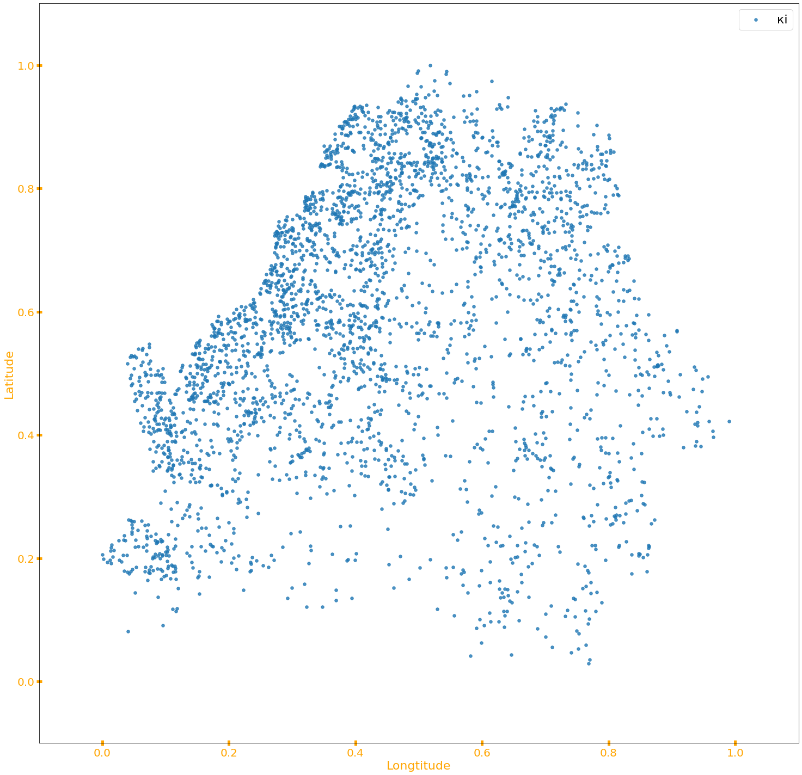
    


```python
filtered_plot(drawing_data, get_ending, ["чы"])
```


    
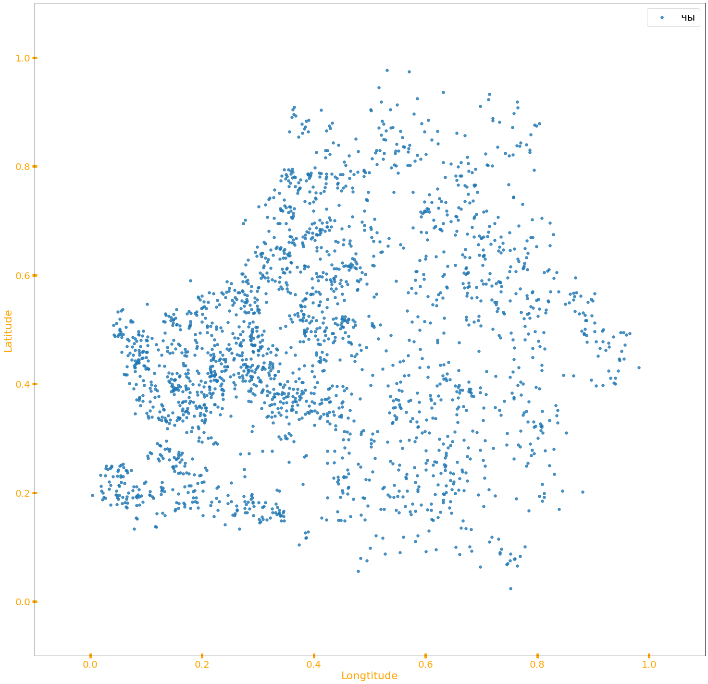
    


```python
filtered_plot(drawing_data, get_ending, ["ка"])
```


    
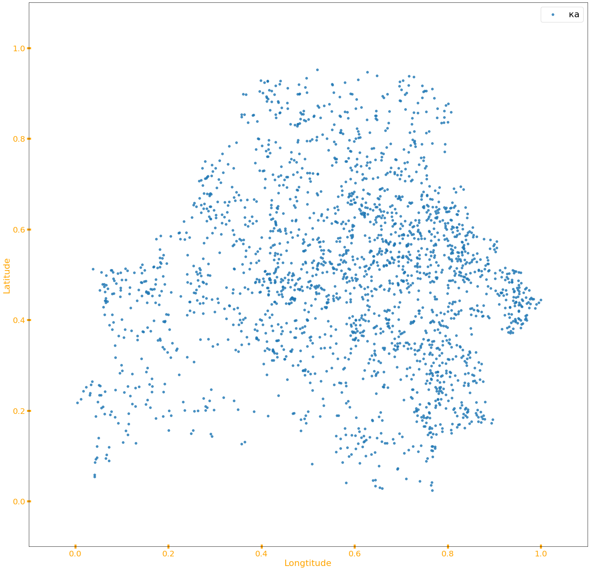
    


### Давайте ещё подробнее взглянем на какое-нибудь равномерное распределение, скажем, "ча" (~0.15 по Пирсону)


```python
filtered_plot(drawing_data, get_ending, ["ча"])
```


    
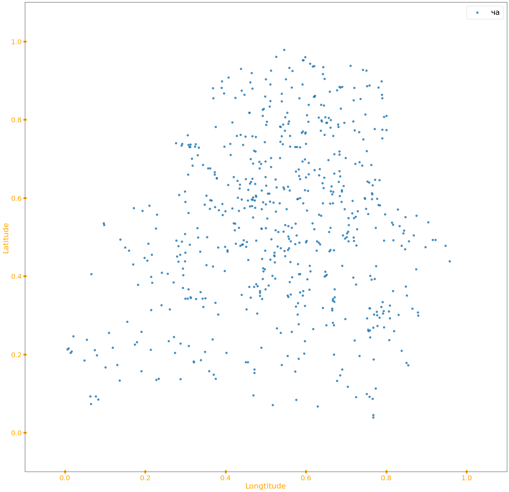
    


### Тут уже, в отличие от предыдущих карт сразу наблюдается почти равномерное распределение городов.

### Многие их этих результатов достаточно просто объясняются историческими фактами, но теперь я, например, смогу действительно подтвердить, что такая зависимость существует, а не отговорится чем-то аля "в началке мне сказали". Мне кажется, что мне удалось статистически подтвердить существование зависимости между географическим положением населённых пунктов Беларуси и их названием.

### Схожие штуки можно провернуть и по остальным параметрам (с которыми мы баловались на картах выше), но у меня пока на этом всё)


```python

```

# Спасибо за внимание!
